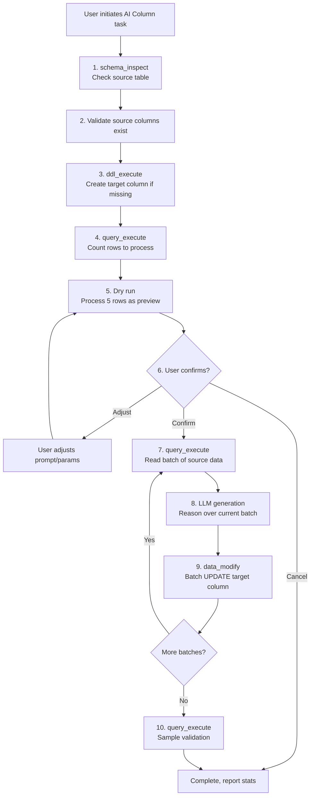

# AI Column -- Design Document

> Chinese version: [DESIGN_AI_COLUMN_CN.md](DESIGN_AI_COLUMN_CN.md)

## 1. Overview

**AI Column** is a queryclaw Skill that automatically generates or fills a column in the same table (or a different table) using LLM reasoning on existing data.

Traditional databases can only derive columns with deterministic expressions (`GENERATED COLUMN`, `UPDATE ... SET col = expr`). AI Column goes beyond this: it lets the LLM understand the **semantics** of source data to produce results that require "understanding meaning" -- summaries, classifications, translations, scores, tags, and more.

This is a capability unique to "giving a database to an Agent."

---

## 2. Use Cases

| # | Source Data | AI-Generated Column | Scenario |
|---|-----------|-------------------|----------|
| 1 | `products.description` | `products.summary` | One-sentence summary |
| 2 | `reviews.content` | `reviews.sentiment` | Sentiment analysis (positive/negative/neutral) |
| 3 | `articles.body` | `articles.category` | Auto-classification |
| 4 | `products.name_cn` | `products.name_en` | Translation |
| 5 | `tickets.description` | `tickets.priority` | Priority prediction |
| 6 | `orders.*` (multiple cols) | `orders.risk_level` | Multi-field risk scoring |
| 7 | `customers.*` | `customer_tags.tag` (cross-table) | Cross-table tag generation |
| 8 | `logs.message` | `logs.error_type` | Log classification |

---

## 3. User Interaction Example

```
User: Based on the description column in the products table,
      generate a summary column with a one-sentence product summary.

Agent: Sure, let me handle that:
  1. Checking products table structure... ✓ Table exists, 1,200 rows
  2. summary column doesn't exist, creating VARCHAR(500)... ✓
  3. Dry-run on 5 rows:
     | id | description (truncated)     | summary (AI generated)       |
     |----|----------------------------|------------------------------|
     | 1  | This premium wireless...   | Premium wireless earbuds...  |
     | 2  | Handcrafted from genuine...| Genuine leather wallet...    |
     | ...                                                            |
  4. How do these look? I'll process the remaining 1,195 rows
     after confirmation. [Continue/Adjust/Cancel]

User: Continue

Agent: Processing in batches...
  - Batch 1/12: 100 rows done
  - Batch 2/12: 200 rows done
  - ...
  - Batch 12/12: all 1,200 rows complete ✓
  Sample validation (5 random rows):
     | id  | summary                         |
     |-----|---------------------------------|
     | 247 | Compact travel adapter...       |
     | 891 | Organic cotton baby blanket...  |
     | ... |                                 |
  Done. Processed 1,200 rows in ~3 minutes.
```

---

## 4. Architecture

### 4.1 Execution Flow



### 4.2 Core Concepts

#### Task Definition

An AI Column task consists of:

| Element | Description | Example |
|---------|-------------|---------|
| Source table | Table to read data from | `products` |
| Source columns | Columns sent to LLM (one or more) | `description` or `name, price, category` |
| Target table | Table to write results (defaults to source) | `products` |
| Target column | Column to fill with AI results | `summary` |
| Target column type | Data type (auto-inferred or user-specified) | `VARCHAR(500)` |
| Prompt intent | Natural language description of desired output | "One-sentence product summary" |
| Filter | Optional, limit scope | `WHERE category = 'electronics'` |
| Join key | For cross-table writes | `products.id = translations.product_id` |

#### Prompt Construction

The Agent automatically constructs internal prompts from the user's natural language intent. **Users do not write prompt templates** -- the Agent understands and generates them:

- User says "sentiment analysis" → internal prompt: "Classify the sentiment as positive, negative, or neutral: {content}"
- User says "translate to English" → internal prompt: "Translate the following Chinese text to English: {text}"
- User says "assign a risk score" → internal prompt: "Based on the order details below, assign a risk level (low/medium/high): {order_data}"

#### Batch Processing Strategy

```
Total rows N
  │
  ├─ N ≤ 20       → Single batch, process row by row
  ├─ 20 < N ≤ 500 → Batches of 50 rows
  └─ N > 500      → Batches of 100 rows; suggest background subagent
```

Per-batch flow:
1. `SELECT id, source_cols FROM table WHERE target_col IS NULL LIMIT batch_size`
2. Call LLM for each row (or pack multiple rows into one call depending on task complexity)
3. `UPDATE table SET target_col = %s WHERE id = %s` (batch parameterized)
4. Report batch progress

### 4.3 Safety Guarantees

| Layer | Measure | Description |
|-------|---------|-------------|
| Dry run | Process 5 rows first | User confirms output quality before batch execution |
| Transaction | Wrap each batch | Batch failure rolls back only that batch |
| Idempotency | `WHERE target_col IS NULL` | Rows with existing values are skipped |
| Resumable | Re-run after interruption | Only processes remaining NULL rows |
| Backup | Optional snapshot | Snapshot target column before processing |
| Confirmation | Human review | Dry-run results + post-completion sampling |

### 4.4 Cross-Table Writes

When target table differs from source table:

```sql
-- Source: products(id, name_cn)
-- Target: product_translations(product_id, name_en)

-- Read:
SELECT p.id, p.name_cn
FROM products p
LEFT JOIN product_translations pt ON p.id = pt.product_id
WHERE pt.name_en IS NULL

-- Write:
INSERT INTO product_translations (product_id, name_en) VALUES (%s, %s)
ON DUPLICATE KEY UPDATE name_en = %s  -- MySQL
```

The Agent handles JOIN logic and INSERT vs UPDATE selection automatically.

---

## 5. Skill Definition

```markdown
---
name: ai_column
description: >
  Generate or fill a database column with AI-derived values based on existing
  table data. Supports summarization, classification, translation, scoring,
  tagging, and any semantic transformation that an LLM can perform.
always: false
---

# AI Column

Use LLM reasoning to populate a column from existing data.

## When to Use

User asks to:
- Generate/fill/create a column based on existing data using AI
- Summarize, classify, translate, score, or tag rows
- Derive semantic information that SQL expressions cannot compute

## Workflow

### Step 1: Understand the Task
Clarify: source table & columns, target column, what to generate, any filters.

### Step 2: Inspect & Prepare
- `schema_inspect` the source table
- If target column missing → `ddl_execute` to ADD COLUMN
- `query_execute` to count rows (with filter if any)

### Step 3: Dry Run (5 rows)
- Read 5 sample rows
- Generate target values
- Present results to user in a table
- Ask for confirmation before proceeding

### Step 4: Batch Process
- Read rows in batches (50-100) WHERE target_col IS NULL
- Generate values for each row
- UPDATE in batches, wrapped in transactions
- Report progress after each batch

### Step 5: Validate
- Sample 5-10 random completed rows
- Show to user for quality check

## Key Rules
- ALWAYS dry-run before batch processing
- ALWAYS use WHERE target_col IS NULL for idempotency
- ALWAYS wrap batch writes in transactions
- For tables > 500 rows, suggest background processing
- For cross-table writes, handle JOIN and INSERT/UPDATE logic
```

---

## 6. Relationship to Framework Components

AI Column introduces no new infrastructure -- it **orchestrates existing components**:

| Framework Component | Role in AI Column |
|--------------------|-------------------|
| `schema_inspect` tool | Check table structure, confirm column existence |
| `query_execute` tool | Read source data, count rows, sample validation |
| `ddl_execute` tool | Create target column |
| `data_modify` tool | Batch UPDATE / INSERT results |
| `transaction` tool | Transaction safety |
| Safety layer | DDL/DML validation, human confirmation |
| LLM provider | Semantic reasoning on each row/batch |
| Subagent system | Background execution for large tables (Phase 2) |
| Memory system | Remember used prompts and column definitions (Phase 3) |

---

## 7. Future Extensions

- **Batch LLM call optimization**: Pack multiple rows into a single LLM call (e.g. "classify sentiment for each of these 10 reviews"), reducing call count
- **Streaming progress**: Real-time progress display and intermediate results during processing
- **Prompt template library**: Accumulate prompt templates for common scenarios (summary, classification, translation, scoring); reusable across sessions via the memory system
- **Incremental updates**: Automatically fill AI column for newly inserted rows (via Cron system)
- **Multi-model strategy**: Use fast/cheap models for simple tasks, high-quality models for complex ones
- **Vector embedding column**: Generate embeddings and store in a column for downstream semantic search
- **Quality assessment**: Auto-sample and evaluate quality after generation; alert when below threshold
