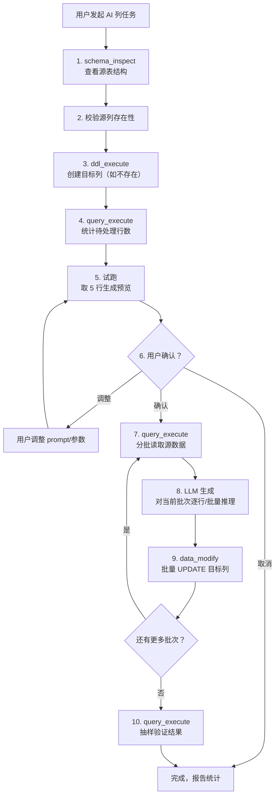

# AI 列（AI Column）—— 设计文档

> English version: [DESIGN_AI_COLUMN.md](DESIGN_AI_COLUMN.md)

## 1. 概述

**AI 列**是 queryclaw 的一项 Skill，能够基于表中已有数据，借助大语言模型，**自动生成或填充**同一张表（或另一张表）的某一列。

传统数据库只能用确定性表达式派生列（`GENERATED COLUMN`、`UPDATE ... SET col = expr`）。AI 列突破了这一限制：它让 LLM 理解源数据的**语义**，产出只有「理解含义」才能得到的结果——摘要、分类、翻译、评分、标签等。

这是「把数据库交给 Agent」后特有的能力。

---

## 2. 使用场景

| # | 源数据 | AI 生成列 | 场景说明 |
|---|--------|----------|---------|
| 1 | `products.description` | `products.summary` | 一句话摘要 |
| 2 | `reviews.content` | `reviews.sentiment` | 情感分析（正面/负面/中性） |
| 3 | `articles.body` | `articles.category` | 自动分类 |
| 4 | `products.name_cn` | `products.name_en` | 翻译 |
| 5 | `tickets.description` | `tickets.priority` | 优先级预测 |
| 6 | `orders.*`（多列） | `orders.risk_level` | 综合多字段的风险评分 |
| 7 | `customers.*` | `customer_tags.tag`（另一张表） | 跨表写入标签 |
| 8 | `logs.message` | `logs.error_type` | 日志分类 |

---

## 3. 用户交互示例

```
用户: 基于 products 表的 description 列，生成一个 summary 列，用一句话概括产品描述。

Agent: 好的，让我来处理：
  1. 检查 products 表结构... ✓ 表存在，有 1,200 行
  2. summary 列不存在，创建 VARCHAR(500) 列... ✓
  3. 先试跑 5 行确认效果：
     | id | description (截断)          | summary (AI 生成)            |
     |----|----------------------------|------------------------------|
     | 1  | This premium wireless...   | Premium wireless earbuds...  |
     | 2  | Handcrafted from genuine...| Genuine leather wallet...    |
     | ...                                                            |
  4. 这 5 行效果如何？确认后我将处理剩余 1,195 行。[继续/调整/取消]

用户: 继续

Agent: 正在批量处理...
  - 批次 1/12: 100 行已完成
  - 批次 2/12: 200 行已完成
  - ...
  - 批次 12/12: 1,200 行全部完成 ✓
  抽样验证 5 条结果：
     | id  | summary                         |
     |-----|---------------------------------|
     | 247 | Compact travel adapter...       |
     | 891 | Organic cotton baby blanket...  |
     | ... |                                 |
  全部完成。共处理 1,200 行，耗时约 3 分钟。
```

---

## 4. 架构设计

### 4.1 执行流程



### 4.2 核心概念

#### 任务定义

一个 AI 列任务由以下要素组成：

| 要素 | 说明 | 示例 |
|------|------|------|
| 源表 | 读取数据的表 | `products` |
| 源列 | 传给 LLM 的列（可多列） | `description` 或 `name, price, category` |
| 目标表 | 写入结果的表（默认同源表） | `products` |
| 目标列 | 写入 AI 结果的列 | `summary` |
| 目标列类型 | 列的数据类型（自动推断或用户指定） | `VARCHAR(500)` |
| Prompt 意图 | 用户用自然语言描述期望 | 「用一句话概括产品描述」 |
| 过滤条件 | 可选，限定处理范围 | `WHERE category = 'electronics'` |
| 关联键 | 跨表时的 JOIN 键 | `products.id = translations.product_id` |

#### Prompt 构造

Agent 根据用户的自然语言意图，自动构造内部 prompt。**用户无需编写 prompt 模板**，Agent 自行理解并生成，例如：

- 用户说「情感分析」→ Agent 内部 prompt: "Classify the sentiment as positive, negative, or neutral: {content}"
- 用户说「翻译成英文」→ Agent 内部 prompt: "Translate the following Chinese text to English: {text}"
- 用户说「给个风险评分」→ Agent 内部 prompt: "Based on the order details below, assign a risk level (low/medium/high): {order_data}"

#### 批量处理策略

```
总行数 N
  │
  ├─ N ≤ 20     → 单批处理，逐行调用 LLM
  ├─ 20 < N ≤ 500  → 分批，每批 50 行
  └─ N > 500    → 分批，每批 100 行；建议使用后台子代理
```

每批处理流程：
1. `SELECT id, source_cols FROM table WHERE target_col IS NULL LIMIT batch_size`
2. 对每行调用 LLM（或将多行打包到一次调用中，视任务复杂度而定）
3. `UPDATE table SET target_col = %s WHERE id = %s`（批量参数化）
4. 报告本批进度

### 4.3 安全保障

| 层级 | 措施 | 说明 |
|------|------|------|
| 试跑 | 先处理 5 行 | 用户确认效果后再批量执行 |
| 事务 | 每批包在事务中 | 一批失败则该批回滚，不影响已完成批次 |
| 幂等 | `WHERE target_col IS NULL` | 已有值的行不重复处理 |
| 可恢复 | 中断后重跑 | 只处理剩余 NULL 行 |
| 备份 | 可选的快照 | 处理前可为目标列建快照 |
| 确认 | 人工审核 | 试跑结果 + 完成后抽样验证 |

### 4.4 跨表写入

当目标表与源表不同时：

```sql
-- 源: products(id, name_cn)
-- 目标: product_translations(product_id, name_en)

-- 读取:
SELECT p.id, p.name_cn
FROM products p
LEFT JOIN product_translations pt ON p.id = pt.product_id
WHERE pt.name_en IS NULL

-- 写入:
INSERT INTO product_translations (product_id, name_en) VALUES (%s, %s)
ON DUPLICATE KEY UPDATE name_en = %s  -- MySQL
```

Agent 自动处理 JOIN 逻辑和 INSERT/UPDATE 选择。

---

## 5. Skill 定义

```markdown
---
name: ai_column
description: >
  Generate or fill a database column with AI-derived values based on existing
  table data. Supports summarization, classification, translation, scoring,
  tagging, and any semantic transformation that an LLM can perform.
always: false
---

# AI Column

Use LLM reasoning to populate a column from existing data.

## When to Use

User asks to:
- Generate/fill/create a column based on existing data using AI
- Summarize, classify, translate, score, or tag rows
- Derive semantic information that SQL expressions cannot compute

## Workflow

### Step 1: Understand the Task
Clarify: source table & columns, target column, what to generate, any filters.

### Step 2: Inspect & Prepare
- `schema_inspect` the source table
- If target column missing → `ddl_execute` to ADD COLUMN
- `query_execute` to count rows (with filter if any)

### Step 3: Dry Run (5 rows)
- Read 5 sample rows
- Generate target values
- Present results to user in a table
- Ask for confirmation before proceeding

### Step 4: Batch Process
- Read rows in batches (50-100) WHERE target_col IS NULL
- Generate values for each row
- UPDATE in batches, wrapped in transactions
- Report progress after each batch

### Step 5: Validate
- Sample 5-10 random completed rows
- Show to user for quality check

## Key Rules
- ALWAYS dry-run before batch processing
- ALWAYS use WHERE target_col IS NULL for idempotency
- ALWAYS wrap batch writes in transactions
- For tables > 500 rows, suggest background processing
- For cross-table writes, handle JOIN and INSERT/UPDATE logic
```

---

## 6. 与框架组件的关系

AI 列不引入新的底层模块，而是**编排已有组件**：

| 框架组件 | AI 列中的作用 |
|---------|-------------|
| `schema_inspect` 工具 | 查看表结构、确认列存在性 |
| `query_execute` 工具 | 读取源数据、统计行数、抽样验证 |
| `ddl_execute` 工具 | 创建目标列 |
| `data_modify` 工具 | 批量 UPDATE / INSERT 结果 |
| `transaction` 工具 | 事务保障 |
| 安全层 | DDL/DML 校验、人工确认 |
| LLM 提供方 | 对每行/每批数据做语义推理 |
| 子代理系统 | 大表场景下的后台执行（阶段二） |
| 记忆系统 | 记住使用过的 prompt 和列定义（阶段三） |

---

## 7. 未来扩展

- **批量 LLM 调用优化**：将多行打包到一次 LLM 调用中（如「对以下 10 条评论分别给出情感标签」），减少调用次数
- **流式处理**：处理过程中实时展示进度和中间结果
- **Prompt 模板库**：积累常用场景的 prompt 模板（摘要、分类、翻译、评分等），可通过记忆系统跨会话复用
- **增量更新**：新增行自动触发 AI 列填充（结合 Cron 系统）
- **多模型策略**：简单任务用快速/低价模型，复杂任务用高质量模型
- **向量嵌入列**：生成 embedding 并存入列，为后续语义搜索做准备
- **质量评估**：生成后自动抽样评估质量，低于阈值时告警
