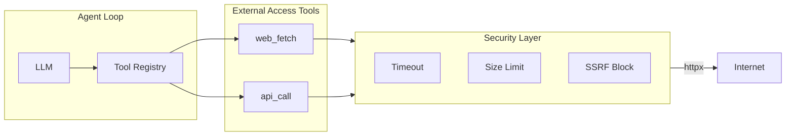

# QueryClaw External Network Access Design

> [中文版](zh/DESIGN_EXTERNAL_ACCESS.md)

## Goal

Enable the agent to fetch web pages, call REST APIs, and optionally search the web — for use cases like enriching database records with external data, validating URLs, or fetching reference documentation.

## Architecture



## 1. New Tools

### 1.1 `web_fetch`

Fetch content from a URL. Returns text (HTML stripped or raw), or JSON parsed.

| Parameter | Type | Required | Description |
|-----------|------|----------|-------------|
| `url` | string | Yes | URL to fetch |
| `format` | enum | No | `"text"` (default, strip HTML tags) or `"json"` (parse as JSON) or `"raw"` |
| `max_chars` | integer | No | Max chars to return (default 10000) |

**Example use cases**:
- "Fetch the API docs at https://example.com/api/v1/docs and summarize the endpoints"
- "Get the current exchange rate from https://api.exchangerate.host/latest"

### 1.2 `api_call`

Generic REST API call with method, headers, and body.

| Parameter | Type | Required | Description |
|-----------|------|----------|-------------|
| `url` | string | Yes | API endpoint URL |
| `method` | enum | No | `GET`, `POST`, `PUT`, `PATCH`, `DELETE` (default: GET) |
| `headers` | object | No | Optional request headers |
| `body` | object/string | No | Request body (JSON or string) |
| `max_chars` | integer | No | Max chars in response (default 10000) |

**Example use cases**:
- "Call the weather API to get today's forecast for Beijing"
- "POST to our webhook to notify when the migration completes"

### 1.3 `web_search` (Optional, Phase 2)

Search the web and return snippets. Requires an API key (Serper, Bing, etc.).

| Parameter | Type | Required | Description |
|-----------|------|----------|-------------|
| `query` | string | Yes | Search query |
| `num_results` | integer | No | Number of results (default 5) |

## 2. Security Layer

### 2.1 Additional Guards

| Guard | Default | Purpose |
|-------|---------|---------|
| `timeout_seconds` | 10 | Abort long-running requests |
| `max_response_chars` | 50000 | Prevent huge responses from blowing up context |
| `block_local` | true | Block 127.0.0.1, localhost, 10.x, 192.168.x (SSRF prevention) |
| `block_file` | true | Block `file://` URLs |

### 2.2 SSRF Prevention

- Reject URLs that resolve to private IP ranges
- Reject `file://`, `ftp://` (if not needed)
- Use `httpx` with `follow_redirects=True`; validate final URL is not private/local

### 2.3 TODO: Domain Allowlist (Future)

- **Deferred**: Domain allowlist (`allowed_domains`) is not implemented in Phase 1
- When added: only URLs whose host matches the allowlist may be fetched
- Use case: restrict access to specific APIs/docs in production

## 3. Configuration

### 3.1 Config Schema

Add to [config/schema.py](queryclaw/config/schema.py):

```python
class ExternalAccessConfig(Base):
    """External network access configuration."""

    enabled: bool = False
    timeout_seconds: int = 10
    max_response_chars: int = 50000
    block_local: bool = True
    block_file: bool = True
    # TODO: allowed_domains: list[str] — domain allowlist (future)
```

Add to root config:

```python
external_access: ExternalAccessConfig = Field(default_factory=ExternalAccessConfig)
```

### 3.2 Config File Example

```json
{
  "external_access": {
    "enabled": true,
    "timeout_seconds": 10,
    "max_response_chars": 50000
  }
}
```

## 4. Implementation Files

| File | Purpose |
|------|---------|
| `queryclaw/tools/web_fetch.py` | `WebFetchTool` — fetch URL, return text/JSON |
| `queryclaw/tools/api_call.py` | `ApiCallTool` — REST API call |
| `queryclaw/safety/external.py` | `ExternalAccessPolicy` — URL validation, SSRF checks (allowlist: TODO) |
| `queryclaw/config/schema.py` | Add `ExternalAccessConfig` |
| `queryclaw/agent/loop.py` | Register tools only when `external_access.enabled` |

### 4.1 Tool Registration

In [loop.py](queryclaw/agent/loop.py) `_register_default_tools()`:

```python
# After existing tools...
if getattr(self.config, "external_access", None) and self.config.external_access.enabled:
    policy = ExternalAccessPolicy(self.config.external_access)
    self.tools.register(WebFetchTool(policy))
    self.tools.register(ApiCallTool(policy))
```

Note: `AgentLoop` currently receives `safety_policy` but not full config. We need to pass `external_access` config — either via `SafetyPolicy` extension or a new `AgentLoop` parameter.

### 4.2 ExternalAccessPolicy

```python
# queryclaw/safety/external.py
class ExternalAccessPolicy:
    def __init__(self, config: ExternalAccessConfig): ...
    def is_allowed(self, url: str) -> tuple[bool, str]:  # (allowed, reason)
    def _check_ssrf(self, parsed: urllib.parse.ParseResult) -> bool
    # TODO: def _check_allowlist(self, host: str) -> bool
```

## 5. Context / System Prompt

When external tools are enabled, add to the system prompt (in [context.py](queryclaw/agent/context.py) or identity section):

```
## External Access (if enabled)
- `web_fetch` — fetch URL content (text or JSON)
- `api_call` — make REST API calls (GET, POST, etc.)
```

## 6. Dependencies

- `httpx` — already used by Feishu/DingTalk channels; use for `web_fetch` and `api_call`
- No new optional extras needed if `httpx` is already a dependency; otherwise add `queryclaw[external]` with `httpx`

## 7. Audit (Optional)

Consider logging external fetches to the audit table for compliance:

- `operation_type`: `web_fetch` / `api_call`
- `sql_text`: URL (or empty)
- `metadata`: `{"url": "...", "status_code": 200, "response_size": 1234}`

## 8. Phase Plan

| Phase | Scope | Effort |
|-------|-------|--------|
| 1 | `web_fetch` + `api_call` + SSRF | Medium |
| 2 | `web_search` (Serper/Bing API) | Low |
| 3 | Audit logging for external calls | Low |
| 4 | Domain allowlist (`allowed_domains`) | Low |

## 9. Key Design Decisions

- **Off by default**: `enabled: false` — users must explicitly enable
- **No allowlist in Phase 1**: All public URLs allowed when enabled; domain allowlist deferred to TODO
- **Shared httpx client**: Reuse existing `httpx.AsyncClient` pattern from channels
- **Token budget**: `max_response_chars` caps response size to avoid blowing up LLM context
