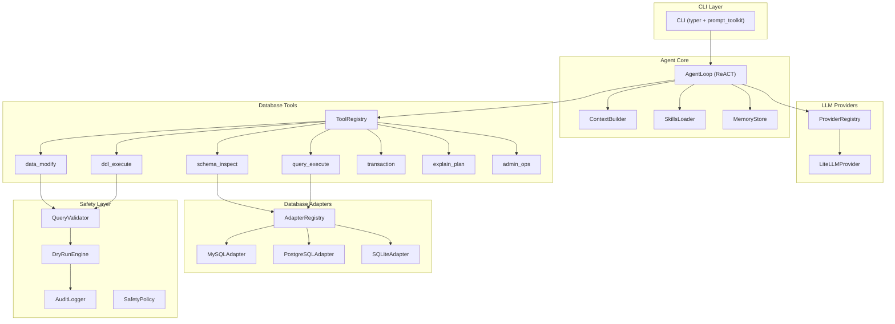

# QueryClaw: AI-Native Database Agent -- Architecture & Implementation Plan

> Chinese version: [PLAN_ARCHITECTURE_CN.md](PLAN_ARCHITECTURE_CN.md)

## 1. Core Concept

**openclaw : OS = queryclaw : Database**

openclaw lets an LLM control a personal computer; queryclaw lets an LLM control a database instance. The user hands over a complete database (MySQL / PostgreSQL / SQLite), and the Agent autonomously explores schemas, queries data, modifies records, optimizes performance, and performs administrative tasks -- all via natural language.

## 2. Architecture Overview

Modeled after [nanobot](nanobot/nanobot/), adapted for database domain:



## 3. Directory Structure

```
queryclaw/
├── queryclaw/
│   ├── __init__.py
│   ├── agent/
│   │   ├── loop.py          # ReACT agent loop (ref: nanobot/agent/loop.py)
│   │   ├── context.py       # System prompt + schema context builder
│   │   ├── memory.py        # Conversation & operation memory
│   │   └── skills.py        # Skill loader (SKILL.md format)
│   ├── providers/
│   │   ├── base.py          # LLMProvider ABC (ref: nanobot/providers/base.py)
│   │   ├── registry.py      # Provider auto-detect registry
│   │   └── litellm_provider.py  # LiteLLM unified backend
│   ├── tools/
│   │   ├── base.py          # Tool ABC (ref: nanobot/agent/tools/base.py)
│   │   ├── registry.py      # ToolRegistry
│   │   ├── schema.py        # schema_inspect, schema_search
│   │   ├── query.py         # query_execute (SELECT)
│   │   ├── modify.py        # data_modify (INSERT/UPDATE/DELETE)
│   │   ├── ddl.py           # ddl_execute (CREATE/ALTER/DROP)
│   │   ├── transaction.py   # begin/commit/rollback
│   │   ├── explain.py       # EXPLAIN / query plan analysis
│   │   └── admin.py         # DB-level ops (users, grants, stats)
│   ├── db/
│   │   ├── base.py          # DatabaseAdapter ABC
│   │   ├── registry.py      # Adapter registry (by db type)
│   │   ├── mysql.py         # MySQL adapter
│   │   ├── postgresql.py    # PostgreSQL adapter
│   │   └── sqlite.py        # SQLite adapter
│   ├── safety/
│   │   ├── validator.py     # AST-based SQL validation
│   │   ├── policy.py        # Safety policy (read-only, allow-list, etc.)
│   │   ├── dry_run.py       # Dry-run engine (EXPLAIN + affected rows)
│   │   └── audit.py         # Audit log (before/after snapshots)
│   ├── config/
│   │   ├── schema.py        # Pydantic config model
│   │   └── loader.py        # Config file loader (~/.queryclaw/config.json)
│   ├── cli/
│   │   └── commands.py      # typer CLI (chat, onboard, config)
│   └── skills/              # Built-in skills (SKILL.md; see SKILLS_ROADMAP)
│       ├── ai_column/
│       ├── test_data_factory/
│       ├── schema_documenter/
│       ├── data_detective/
│       ├── query_translator/
│       ├── index_advisor/
│       ├── data_healer/
│       ├── smart_migrator/
│       └── ...               # + Anomaly Scanner, Data Masker, etc.
├── pyproject.toml
├── README.md
└── LICENSE
```

## 4. Key Components (from nanobot, adapted)

### 4.1 Database Adapter Layer (`queryclaw/db/`)

Extensible multi-database support. **Phase 1 prioritizes MySQL + SQLite** (MySQL as primary target, SQLite for zero-config testing/demo). PostgreSQL deferred to Phase 2.

Two-layer abstraction to support future non-relational databases (MongoDB, Redis, Elasticsearch):

```python
class DatabaseAdapter(ABC):
    """Universal adapter interface -- all database types must implement"""
    async def connect(self, config: DBConfig) -> None
    async def execute(self, command: str, params=None) -> QueryResult
    async def get_structure(self) -> StructureInfo
    async def close(self) -> None
    @property
    def db_type(self) -> str  # "mysql", "sqlite", "mongodb", ...

class SQLAdapter(DatabaseAdapter):
    """SQL specialization -- common methods for relational databases"""
    async def get_schemas(self) -> list[SchemaInfo]
    async def get_tables(self, schema: str) -> list[TableInfo]
    async def get_columns(self, table: str) -> list[ColumnInfo]
    async def get_indexes(self, table: str) -> list[IndexInfo]
    async def get_foreign_keys(self, table: str) -> list[FKInfo]
    async def explain(self, sql: str) -> ExplainResult
    async def begin_transaction(self) -> TransactionHandle

# Future non-SQL databases implement their own specialization
# class DocumentAdapter(DatabaseAdapter): ...  # MongoDB
# class KVAdapter(DatabaseAdapter): ...        # Redis
```

User configures database type and connection in `~/.queryclaw/config.json`:

```json
{
  "database": {
    "type": "mysql",
    "host": "localhost",
    "port": 3306,
    "database": "myapp",
    "user": "root",
    "password": "***"
  }
}
```

### 4.2 Agent ReACT Loop (`queryclaw/agent/loop.py`)

Same pattern as `nanobot/agent/loop.py`:

- **Reason**: LLM receives user request + schema context + conversation history
- **Act**: LLM calls database tools (inspect schema, run query, modify data...)
- **Observe**: Tool results fed back to LLM
- **Repeat** until LLM produces a final answer (no more tool calls)

### 4.3 Database Tools (`queryclaw/tools/`)

| Tool             | Description                                       | Safety Level        |
| ---------------- | ------------------------------------------------- | ------------------- |
| `schema_inspect` | List databases/schemas/tables/columns/indexes/FKs | Safe (read-only)    |
| `query_execute`  | Run SELECT queries, return results                | Safe (read-only)    |
| `explain_plan`   | Run EXPLAIN on a query, show execution plan       | Safe (read-only)    |
| `data_modify`    | INSERT / UPDATE / DELETE (via safety layer)       | Requires validation |
| `ddl_execute`    | CREATE / ALTER / DROP (via safety layer)          | Requires validation |
| `transaction`    | BEGIN / COMMIT / ROLLBACK                         | Context-dependent   |
| `admin_ops`      | User management, grants, DB stats                 | Privileged          |

### 4.4 Safety Layer (`queryclaw/safety/`)

Progressive safety:

1. **Policy check**: Is this operation type allowed? (configurable read-only / read-write / full)
2. **SQL validation**: Parse SQL AST, detect dangerous patterns (DROP DATABASE, DELETE without WHERE, etc.)
3. **Dry-run**: EXPLAIN the statement, estimate affected rows, show execution plan
4. **Human confirmation**: For destructive operations, prompt user "This will delete 1,234 rows. Proceed? [y/N]"
5. **Transaction wrap**: Auto-wrap modifications in transactions; rollback on error
6. **Audit log**: Record before/after snapshots, full SQL lineage

### 4.5 LLM Providers (`queryclaw/providers/`)

Directly reference nanobot's provider pattern:

- `LLMProvider` ABC with `chat()` method
- `LiteLLMProvider` for unified multi-provider support
- `ProviderRegistry` for auto-detection by model name / API key
- User configures in `~/.queryclaw/config.json`

### 4.6 Skills System (`queryclaw/skills/`)

Skills use the SKILL.md format (same as nanobot). Each skill encodes a domain workflow so the Agent knows when and how to use it. The full catalog and priorities are in [docs/SKILLS_ROADMAP.md](SKILLS_ROADMAP.md); below is the phase mapping.

**By workflow stage:**

| Stage | Skills |
|-------|--------|
| **Development** | AI Column, Test Data Factory, Schema Documenter, API Scaffolding |
| **Debugging** | Data Detective, Query Translator |
| **Data Quality & Governance** | Data Healer, Data Masker, Anomaly Scanner |
| **Performance & Operations** | Index Advisor, Change Impact Analyzer, Capacity Planner |
| **Compliance & Security** | Compliance Scanner, Permission Auditor |
| **Migration & Evolution** | Smart Migrator, Cross-DB Sync Checker |

**Priority and suggested phase:**

| Priority | Skill | Phase | Value |
|----------|-------|-------|-------|
| High | AI Column, Test Data Factory, Data Detective, Schema Documenter | 2 | Core differentiator; developer daily use |
| Medium | Query Translator | 2 | Low cost, high value |
| Medium | Index Advisor, Data Healer, Anomaly Scanner, Data Masker, Smart Migrator | 3 | Data governance, operations |
| Low | Change Impact Analyzer | 3 | Advanced operations |
| Low | Capacity Planner, Compliance Scanner, Permission Auditor, API Scaffolding | 4 | Enterprise / DBA |
| Low | Cross-DB Sync Checker | 4+ | After multi-DB support |

## 5. What Can We Do With a Database Under Agent Control?

This is the exploratory core. Initial capabilities to implement:

- **Natural Language Querying**: "Show me the top 10 customers by revenue last quarter"
- **Schema Exploration**: "What tables are related to the orders system? Show me the ER relationships"
- **Data Analysis**: "Are there any anomalies in the transaction data from this week?"
- **Safe Data Modification**: "Update all users with expired subscriptions to inactive status" (with dry-run + confirmation)
- **Schema Evolution**: "Add a `last_login` column to the users table" (with migration plan)
- **Performance Diagnostics**: "Why is this query slow?" (EXPLAIN analysis + index suggestions)
- **Data Quality Checks**: "Find orphaned records, duplicate entries, or NULL violations"
- **Report Generation**: "Generate a monthly sales summary grouped by region"
- **Backup & Restore**: "Create a snapshot of the orders table before I make changes"
- **Access Control Review**: "Show me all database users and their privileges"

## 6. Advanced Features Analysis (from nanobot)

### Near-term (Phase 2-3)

- **A. Subagent system**: Background long-running tasks (large-scale analysis, full table scans, cross-table checks)
- **B. Memory system**: Two-layer memory (MEMORY.md for schema knowledge, HISTORY.md for operation log)
- **C. Cron system**: Scheduled health checks, performance monitoring, data quality audits
- **D. Heartbeat**: Proactive database monitoring and anomaly alerts
- **E. Message bus + channels**: Push results/alerts to Telegram, Slack, Feishu, etc.

### Long-term (Phase 4+)

- **F. MCP server mode**: Expose queryclaw as MCP tool for other agents
- **G. Multi-database connections**: Connect to multiple databases simultaneously
- **H. Data lineage tracking**: Full operation audit trail
- **I. NL-to-stored-procedures/views**: Persist common queries as DB objects
- **J. Migration orchestration**: Generate and preview migration scripts
- **K. Intelligent index advisor**: Analyze slow queries, suggest indexes

---

## 7. Multi-Database Expansion Roadmap

| Database | Phase | Adapter Layer | Notes |
|----------|-------|---------------|-------|
| **MySQL** | Phase 1 (primary) | `SQLAdapter` | Most common production DB |
| **SQLite** | Phase 1 | `SQLAdapter` | Zero-config for dev/test/demo |
| **PostgreSQL** | Phase 2-3 | `SQLAdapter` | Rich ecosystem, advanced SQL |
| **MongoDB** | Phase 4+ | `DocumentAdapter` | Document-oriented, MQL |
| **Redis** | Phase 4+ | `KVAdapter` | Key-Value, command-based |
| **Elasticsearch** | Future | `SearchAdapter` | Full-text search & analytics |
| **ClickHouse** | Future | `SQLAdapter` | Columnar analytics |

---

### 7.1 Vector & AI-Native Databases (Phase 4+)

Combining with vector stores and AI-native databases adds distinct capabilities:

| Direction | Highlight | Dependency |
|-----------|-----------|------------|
| **Vector + Schema** | Semantic table/column search (RAG over schema + docs), scales to large schemas | Vector store (pgvector or dedicated) |
| **Vector + Query** | Hybrid queries: SQL filters + vector similarity | In-DB or sidecar vector index |
| **Vector + Memory** | Memory as embeddings; semantic recall of history; smarter over time | Memory table + embeddings or vector store |
| **Vector + AI Column** | One-click embedding column for similarity search / dedup / clustering | Model API + vector column type |
| **AI-Native DB** | Single agent entry; use DB as executor; complex tasks orchestrated by QueryClaw | Adapters for each DB's NL/AI API |
| **AI-Native DB** | Skill layer + unified memory/audit; workflows the DB does not provide | Extend current architecture |

**Implementation notes**: Adapters support vector columns or a vector store (e.g. pgvector, Milvus, Chroma); add tools such as `schema_search_semantic` and hybrid query. AI-native DBs (AlloyDB AI, Oracle Select AI, Snowflake Cortex, etc.) are wrapped as optional tools alongside ReACT tools; memory and audit remain written by QueryClaw to the primary DB.

---

## 8. Implementation Phases (Updated)

### Phase 1: MVP -- Read-Only Agent (current)

- CLI with interactive chat (typer + prompt_toolkit)
- ReACT agent loop (from nanobot pattern)
- LLM provider layer (LiteLLM)
- Database adapter layer (**MySQL + SQLite first**)
- Tools: `schema_inspect`, `query_execute`, `explain_plan`
- Basic config system
- Basic skill loading

### Phase 2: Write Operations + Safety + PostgreSQL

- Tools: `data_modify`, `ddl_execute`, `transaction`
- Safety layer: validator, dry-run, audit log
- Human-in-the-loop confirmation for destructive ops
- PostgreSQL adapter
- Subagent system (background long tasks)
- First skills (high priority): AI Column, Test Data Factory, Data Detective, Schema Documenter; Query Translator (medium)

### Phase 3: Advanced Skills + Memory + Cron

- Skills: Index Advisor, Data Healer, Anomaly Scanner, Data Masker, Smart Migrator; Change Impact Analyzer (low)
- Persistent memory (operation history, learned schema knowledge)
- Cron system + Heartbeat (proactive monitoring)
- Multi-step planning for complex tasks

### Phase 4: Multi-Channel Output *(implemented)*

- Message bus + bidirectional channels (Feishu, DingTalk)
- `queryclaw serve` — run Agent in channel mode; ask questions in Feishu/DingTalk and get responses
- Optional dependencies: `queryclaw[feishu]`, `queryclaw[dingtalk]`
- Destructive operations rejected in channel mode when `require_confirmation=True`
- See [PLAN_PHASE4_CHANNELS.md](PLAN_PHASE4_CHANNELS.md) for implementation details

### Phase 4+: Ecosystem Integration + More Databases

- MCP server mode (expose as MCP tool for other agents)
- Additional channels (Telegram, Slack, etc.)
- MongoDB adapter
- Multi-database simultaneous connections
- Skills (low priority): Capacity Planner, Compliance Scanner, Permission Auditor, API Scaffolding; Cross-DB Sync Checker (Phase 4+)
- Web UI (optional)
- Plugin system for custom tools/adapters

### Phase 4+: Vector & AI-Native DB

- Vector store / vector column support (pgvector or sidecar); semantic schema search, hybrid query, vectorized memory
- AI Column extension: generate embedding columns
- AI-native DB adapters (wrap built-in NL/AI); unified memory and audit

---

## Phase 1 Todos

- **phase1-db-adapter**: Implement DatabaseAdapter + SQLAdapter ABC + MySQL adapter + SQLite adapter (`queryclaw/db/`)
- **phase1-providers**: Port LLM provider layer (base, registry, litellm_provider) from nanobot to `queryclaw/providers/`
- **phase1-tools**: Implement Tool ABC + ToolRegistry + read-only tools (schema_inspect, query_execute, explain_plan)
- **phase1-agent**: Implement ReACT AgentLoop + ContextBuilder with schema-aware system prompt
- **phase1-config**: Config system (Pydantic schema + loader) for DB connection + LLM provider settings
- **phase1-cli**: CLI with interactive chat mode (typer + prompt_toolkit)
- **phase1-skills**: SkillsLoader + at least one built-in skill (e.g. data_analysis)
