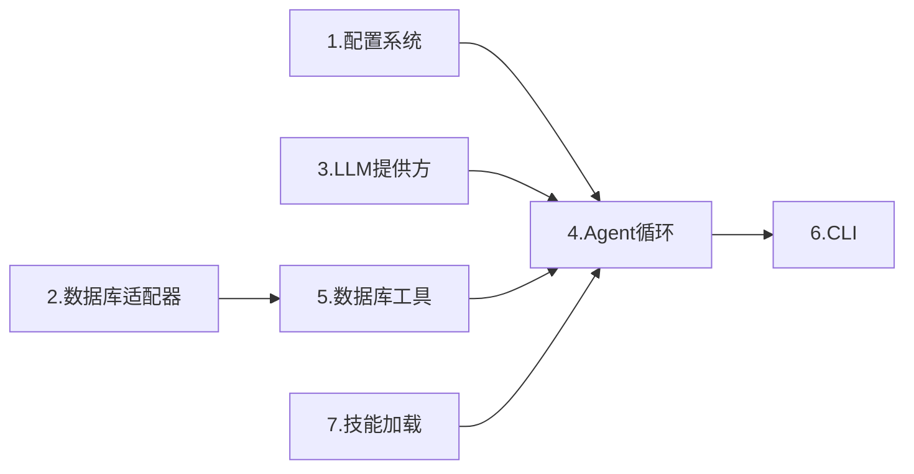

# QueryClaw 第一阶段实现计划（MVP -- 只读 Agent）

## 目标

搭建一个可运行的只读数据库 Agent：用户通过 CLI 用自然语言提问，Agent 通过 ReACT 循环调用数据库工具（查结构、执行 SELECT、分析执行计划），返回结果。

## 实施状态（已完成）

- **批次 A～C** 与 **端到端验证** 已全部完成；所有 to-do 已勾选完成。
- **测试**：143 个用例（config / db / providers / skills / tools / agent / cli），全部通过。
- **E2E**：`scripts/e2e_verify.py` 可重复运行（onboard → SQLite 配置 → chat 无 API key 时预期失败）。
- **实现说明**：数据库适配器 `connect(**kwargs)` 与配置解耦；`AdapterRegistry.create_and_connect(**config.database.model_dump())` 用于 CLI；CLI 在创建 DB 连接前先校验 LLM API key。

## 实现顺序与依赖关系



按依赖拓扑排序：先实现无依赖模块（1/2/3/7），再实现依赖它们的模块（4/5），最后组装 CLI（6）。

---

## 1. 配置系统 (`queryclaw/config/`)

QueryClaw 配置需同时覆盖数据库连接和 LLM 提供方。使用 Pydantic BaseSettings，配置文件位于 `~/.queryclaw/config.json`。

**文件：`queryclaw/config/schema.py`**

```python
class DatabaseConfig(Base):
    type: Literal["mysql", "sqlite"] = "sqlite"
    host: str = "localhost"
    port: int = 3306
    database: str = ""
    user: str = ""
    password: str = ""

class ProviderConfig(Base):
    api_key: str = ""
    api_base: str = ""
    extra_headers: dict[str, str] = Field(default_factory=dict)

class ProvidersConfig(Base):
    openrouter: ProviderConfig = ...
    anthropic: ProviderConfig = ...
    openai: ProviderConfig = ...
    deepseek: ProviderConfig = ...
    gemini: ProviderConfig = ...
    dashscope: ProviderConfig = ...
    moonshot: ProviderConfig = ...
    # ... 与 nanobot 保持一致

class AgentConfig(Base):
    model: str = "anthropic/claude-sonnet-4-5"
    max_iterations: int = 30
    temperature: float = 0.1
    max_tokens: int = 4096

class Config(BaseSettings):
    database: DatabaseConfig
    providers: ProvidersConfig
    agent: AgentConfig
```

与 nanobot 的关键区别：

- 新增 `DatabaseConfig`（数据库连接信息）
- 去掉 channels 相关配置（阶段一只需 CLI）
- 简化 AgentConfig（去掉 workspace、memory_window 等 nanobot 特有字段）

**文件：`queryclaw/config/loader.py`**

- 沿用 nanobot 的 `load_config` / `save_config` 模式
- 配置路径：`~/.queryclaw/config.json`

---

## 2. 数据库适配层 (`queryclaw/db/`)

采用架构计划中的两层抽象。阶段一实现 MySQL + SQLite。

**文件：`queryclaw/db/base.py`** -- 抽象基类

```python
@dataclass
class QueryResult:
    columns: list[str]
    rows: list[tuple]
    affected_rows: int = 0
    execution_time_ms: float = 0

@dataclass
class ColumnInfo:
    name: str
    data_type: str
    nullable: bool
    default: str | None
    is_primary_key: bool
    extra: str  # AUTO_INCREMENT etc.

@dataclass
class TableInfo:
    name: str
    schema: str
    row_count: int | None
    engine: str | None  # MySQL: InnoDB; SQLite: N/A

@dataclass
class IndexInfo:
    name: str
    columns: list[str]
    unique: bool
    type: str  # BTREE, HASH, etc.

@dataclass
class ForeignKeyInfo:
    name: str
    columns: list[str]
    ref_table: str
    ref_columns: list[str]

class DatabaseAdapter(ABC):
    @abstractmethod
    async def connect(self, config: DatabaseConfig) -> None: ...
    @abstractmethod
    async def close(self) -> None: ...
    @abstractmethod
    async def execute(self, sql: str, params=None) -> QueryResult: ...
    @abstractmethod
    async def get_tables(self) -> list[TableInfo]: ...
    @property
    @abstractmethod
    def db_type(self) -> str: ...

class SQLAdapter(DatabaseAdapter):
    @abstractmethod
    async def get_columns(self, table: str) -> list[ColumnInfo]: ...
    @abstractmethod
    async def get_indexes(self, table: str) -> list[IndexInfo]: ...
    @abstractmethod
    async def get_foreign_keys(self, table: str) -> list[ForeignKeyInfo]: ...
    @abstractmethod
    async def explain(self, sql: str) -> QueryResult: ...
```

**文件：`queryclaw/db/mysql.py`** -- MySQL 适配器

- 使用 `aiomysql` 库
- 通过 `INFORMATION_SCHEMA` 查询表/列/索引/外键
- `explain()` 实现 `EXPLAIN FORMAT=JSON {sql}`

**文件：`queryclaw/db/sqlite.py`** -- SQLite 适配器

- 使用 `aiosqlite` 库
- 通过 `sqlite_master` + `PRAGMA table_info` 等查询元信息
- `explain()` 实现 `EXPLAIN QUERY PLAN {sql}`

**文件：`queryclaw/db/registry.py`** -- 适配器注册与工厂

```python
class AdapterRegistry:
    _adapters: dict[str, type[DatabaseAdapter]] = {}

    @classmethod
    def register(cls, db_type: str, adapter_cls: type[DatabaseAdapter]): ...

    @classmethod
    def create(cls, config: DatabaseConfig) -> DatabaseAdapter: ...

# 默认注册
AdapterRegistry.register("mysql", MySQLAdapter)
AdapterRegistry.register("sqlite", SQLiteAdapter)
```

---

## 3. LLM 提供方层 (`queryclaw/providers/`)

**直接复用 nanobot 的三个文件**，做最小改动：

**文件：`queryclaw/providers/base.py`**

- 完整复制 nanobot 的 `ToolCallRequest`、`LLMResponse`、`LLMProvider` -- 这些是通用的

**文件：`queryclaw/providers/registry.py`**

- 复制 nanobot 的 `ProviderSpec` 和 `PROVIDERS` 注册表
- 阶段一可精简到常用几个：OpenRouter、Anthropic、OpenAI、DeepSeek、Gemini、DashScope、Moonshot

**文件：`queryclaw/providers/litellm_provider.py`**

- 复制 nanobot 的 `LiteLLMProvider` -- 它通过 litellm 统一所有提供方，逻辑无需改动

---

## 4. Agent 核心 (`queryclaw/agent/`)

**文件：`queryclaw/agent/loop.py`** -- ReACT 主循环

参考 nanobot `AgentLoop`，但做数据库领域简化：

- 去掉 MessageBus（阶段一只有 CLI）
- 去掉 SubagentManager、CronTool
- 去掉 SessionManager（用内存 list 维护对话历史）
- 核心保留 `_run_agent_loop()` 逻辑：
  1. 调用 `provider.chat(messages, tools)`
  2. 若有 tool_calls，执行后将结果追加到 messages
  3. 循环直至 finish_reason=stop 或达到 max_iterations

```python
class AgentLoop:
    def __init__(
        self,
        provider: LLMProvider,
        db_adapter: DatabaseAdapter,
        model: str,
        max_iterations: int = 30,
        temperature: float = 0.1,
        max_tokens: int = 4096,
    ):
        self.provider = provider
        self.db = db_adapter
        self.model = model
        self.tools = ToolRegistry()
        self.context = ContextBuilder(db_adapter)
        self.skills = SkillsLoader()
        self.history: list[dict] = []
        self._register_default_tools()

    def _register_default_tools(self):
        self.tools.register(SchemaInspectTool(self.db))
        self.tools.register(QueryExecuteTool(self.db))
        self.tools.register(ExplainPlanTool(self.db))

    async def chat(self, user_message: str) -> str:
        messages = self.context.build_messages(
            history=self.history,
            current_message=user_message,
        )
        final_content, tools_used, new_messages = await self._run_agent_loop(messages)
        # 将用户消息和助手回复追加到 history
        self.history.append({"role": "user", "content": user_message})
        self.history.append({"role": "assistant", "content": final_content})
        return final_content
```

**文件：`queryclaw/agent/context.py`** -- 上下文构建

核心差异：system prompt 包含数据库 schema 摘要。

```python
class ContextBuilder:
    def __init__(self, db_adapter: DatabaseAdapter):
        self.db = db_adapter
        self._schema_cache: str | None = None

    async def build_system_prompt(self) -> str:
        parts = [self._get_identity()]
        schema_summary = await self._get_schema_summary()
        if schema_summary:
            parts.append(f"# Database Schema\n\n{schema_summary}")
        skills_content = ...  # load skills
        return "\n\n---\n\n".join(parts)

    async def _get_schema_summary(self) -> str:
        # 查询所有表名 + 列信息，格式化为 LLM 易读的文本
        tables = await self.db.get_tables()
        # 对每个表获取列信息，生成摘要
        ...
```

**文件：`queryclaw/agent/skills.py`** -- 技能加载器

- 简化版 nanobot SkillsLoader
- 从 `queryclaw/skills/` 目录加载 SKILL.md
- 阶段一内置一个基础技能（如 `data_analysis`）

**文件：`queryclaw/agent/memory.py`** -- 基础记忆

- 阶段一仅维护内存级对话历史
- 提供 `add()` / `get_recent()` 接口
- 不做持久化（阶段三再加）

---

## 5. 数据库工具 (`queryclaw/tools/`)

**文件：`queryclaw/tools/base.py`**

- 完整复用 nanobot 的 `Tool` ABC（name / description / parameters / execute / to_schema / validate_params）

**文件：`queryclaw/tools/registry.py`**

- 完整复用 nanobot 的 `ToolRegistry`

**文件：`queryclaw/tools/schema.py`** -- `schema_inspect` 工具

```python
class SchemaInspectTool(Tool):
    name = "schema_inspect"
    description = "Inspect database schema: list tables, columns, indexes, foreign keys"
    parameters = {
        "type": "object",
        "properties": {
            "action": {"type": "string", "enum": ["list_tables", "describe_table", "list_indexes", "list_foreign_keys"]},
            "table": {"type": "string", "description": "Table name (required for describe/indexes/fk)"},
        },
        "required": ["action"],
    }

    async def execute(self, action: str, table: str = "") -> str:
        match action:
            case "list_tables": return format_tables(await self.db.get_tables())
            case "describe_table": return format_columns(await self.db.get_columns(table))
            case "list_indexes": return format_indexes(await self.db.get_indexes(table))
            case "list_foreign_keys": return format_fks(await self.db.get_foreign_keys(table))
```

**文件：`queryclaw/tools/query.py`** -- `query_execute` 工具

```python
class QueryExecuteTool(Tool):
    name = "query_execute"
    description = "Execute a read-only SQL query (SELECT only)"
    # 执行前校验 SQL 是否为 SELECT（简单前缀检查，阶段二升级为 AST 校验）
    # 限制返回行数（默认 100）以防 token 溢出
```

**文件：`queryclaw/tools/explain.py`** -- `explain_plan` 工具

```python
class ExplainPlanTool(Tool):
    name = "explain_plan"
    description = "Show execution plan for a SQL query using EXPLAIN"
    # 调用 db.explain(sql) 并格式化输出
```

---

## 6. CLI 交互 (`queryclaw/cli/`)

**文件：`queryclaw/cli/commands.py`**

参考 nanobot CLI，实现两个核心命令：

- `queryclaw onboard` -- 初始化配置
  - 创建 `~/.queryclaw/config.json`
  - 提示用户配置 LLM API key 和数据库连接
- `queryclaw chat` -- 交互式对话
  - 加载配置 -> 创建 DB 适配器 -> 创建 LLM Provider -> 创建 AgentLoop
  - 用 prompt_toolkit 做交互输入（历史、多行粘贴）
  - 用 rich 渲染 Markdown 输出
  - 支持 `-m "问题"` 单次提问模式

```python
app = typer.Typer(name="queryclaw", no_args_is_help=True)

@app.command()
def chat(
    message: str = typer.Option(None, "-m", "--message"),
    config_path: Path = typer.Option(None, "-c", "--config"),
):
    config = load_config(config_path)
    asyncio.run(_chat_async(config, message))

async def _chat_async(config: Config, initial_message: str | None):
    adapter = AdapterRegistry.create(config.database)
    await adapter.connect(config.database)
    provider = _make_provider(config)
    agent = AgentLoop(provider=provider, db_adapter=adapter, ...)
    # 交互循环
    ...
```

**文件：`queryclaw/cli/__init__.py`** -- 导出 `app`

**入口：`queryclaw/__main__.py`**

```python
from queryclaw.cli.commands import app
app()
```

---

## 7. 技能目录 (`queryclaw/skills/`)

阶段一提供一个示例技能 `data_analysis/SKILL.md`：

```markdown
---
description: "Analyze data patterns, summarize tables, generate reports"
metadata: '{"queryclaw": {"always": false}}'
---
# Data Analysis

When the user asks for data analysis, follow these steps:
1. Use schema_inspect to understand the relevant tables
2. Write appropriate SELECT queries with query_execute
3. Summarize findings in a clear format
...
```

---

## 8. 依赖管理

更新 [queryclaw/pyproject.toml](queryclaw/pyproject.toml)，新增 `dependencies`：

```toml
dependencies = [
    "typer>=0.9",
    "rich>=13.0",
    "prompt-toolkit>=3.0",
    "pydantic>=2.0",
    "pydantic-settings>=2.0",
    "litellm>=1.40",
    "json-repair>=0.20",
    "aiomysql>=0.2",
    "aiosqlite>=0.19",
    "loguru>=0.7",
]
```

增加 `[project.scripts]` 入口：

```toml
[project.scripts]
queryclaw = "queryclaw.cli.commands:app"
```

---

## 9. 需新建的文件清单

共约 18 个新文件（不含 `__init__.py`）：

- `queryclaw/config/__init__.py`
- `queryclaw/config/schema.py`
- `queryclaw/config/loader.py`
- `queryclaw/db/__init__.py`
- `queryclaw/db/base.py`
- `queryclaw/db/mysql.py`
- `queryclaw/db/sqlite.py`
- `queryclaw/db/registry.py`
- `queryclaw/providers/__init__.py`
- `queryclaw/providers/base.py`
- `queryclaw/providers/registry.py`
- `queryclaw/providers/litellm_provider.py`
- `queryclaw/tools/__init__.py`
- `queryclaw/tools/base.py`
- `queryclaw/tools/registry.py`
- `queryclaw/tools/schema.py`
- `queryclaw/tools/query.py`
- `queryclaw/tools/explain.py`
- `queryclaw/agent/__init__.py`
- `queryclaw/agent/loop.py`
- `queryclaw/agent/context.py`
- `queryclaw/agent/skills.py`
- `queryclaw/agent/memory.py`
- `queryclaw/cli/__init__.py`
- `queryclaw/cli/commands.py`
- `queryclaw/__main__.py`
- `queryclaw/skills/data_analysis/SKILL.md`

**测试与 E2E（已实现）：**

- `tests/__init__.py`、`tests/test_config.py`、`tests/test_db.py`、`tests/test_providers.py`、`tests/test_skills.py`、`tests/test_tools.py`、`tests/test_agent.py`、`tests/test_cli.py`
- `scripts/e2e_verify.py`（E2E：onboard → SQLite DB → chat 无 key 时失败）
- `.gitignore` 中增加 `scripts/.e2e_tmp/`

---

## 10. 建议实现顺序

按依赖关系分批实现，每批完成后可独立测试：

**批次 A（基础层，无相互依赖）：**

1. 配置系统 -- config/schema.py + config/loader.py
2. 数据库适配层 -- db/base.py + db/sqlite.py + db/mysql.py + db/registry.py
3. LLM 提供方 -- providers/base.py + providers/registry.py + providers/litellm_provider.py
4. 技能加载 -- agent/skills.py

**批次 B（工具 + Agent 核心）：**
5. 工具系统 -- tools/base.py + tools/registry.py + tools/schema.py + tools/query.py + tools/explain.py
6. Agent 循环 -- agent/loop.py + agent/context.py + agent/memory.py

**批次 C（组装 + 入口）：**
7. CLI -- cli/commands.py + **main**.py
8. pyproject.toml 更新 + 内置技能

**最终验证：**

- `pip install -e .`
- `queryclaw onboard` 初始化配置
- 配置 SQLite 数据库 + LLM API key
- `queryclaw chat -m "这个数据库有哪些表？"` 验证端到端流程
