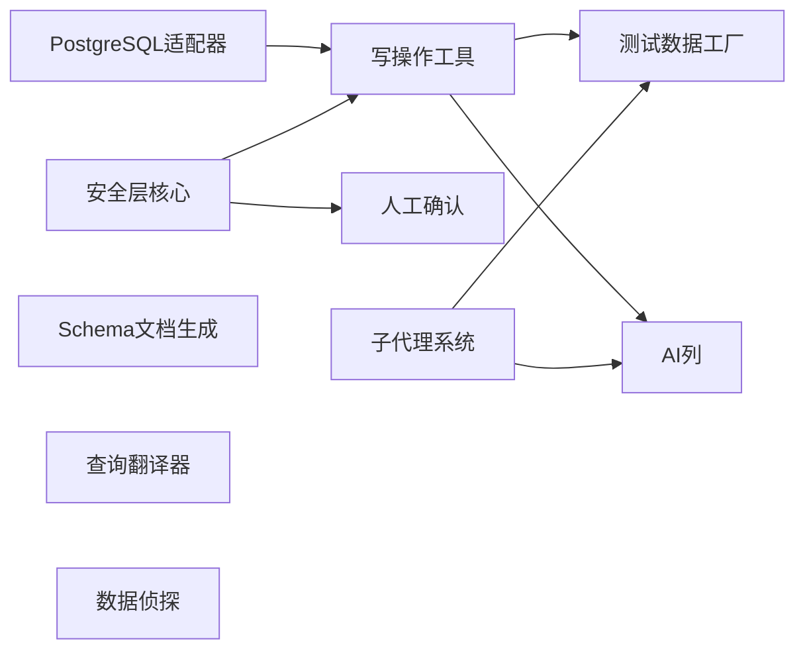

# QueryClaw 第二阶段实施计划（归档）

> **状态：已完成** — 所有批次（A/B/C/D）均已实现并通过测试。

## 目标

在 Phase 1（只读 Agent，v0.1.x）基础上，实现：

- 3 个写操作工具（data_modify / ddl_execute / transaction）
- 分层安全体系（策略 → 校验 → 试跑 → 人工确认 → 审计）
- PostgreSQL 适配器
- 子代理系统（后台长任务）
- 5 个首批技能（AI Column / Test Data Factory / Data Detective / Schema Documenter / Query Translator）

## 依赖关系




按依赖拓扑分为 4 个批次，每批完成后可独立测试。

---

## 批次 A：基础层（无相互依赖，可并行）

### A1. PostgreSQL 适配器

**新建文件：** `queryclaw/db/postgresql.py`

- 使用 `asyncpg` 库（高性能异步 PostgreSQL 驱动）
- 继承 `SQLAdapter`，实现全部抽象方法
- 通过 `information_schema` + `pg_catalog` 获取元数据（表、列、索引、外键）
- `explain()` 实现 `EXPLAIN (FORMAT JSON) {sql}`
- 在 [queryclaw/db/registry.py](queryclaw/db/registry.py) 的 `_register_defaults()` 中注册
- 在 [queryclaw/config/schema.py](queryclaw/config/schema.py) 的 `DatabaseConfig.type` 中增加 `"postgresql"` 选项
- `pyproject.toml` 增加依赖 `asyncpg>=0.29`

**测试：** `tests/test_db_postgresql.py`（用内存或 tmp 方式，或 mock）

### A2. 安全层核心

**新建目录：** `queryclaw/safety/`

**A2-1. 安全策略** — `queryclaw/safety/policy.py`

```python
class SafetyPolicy:
    read_only: bool = True          # Phase 1 默认只读
    max_affected_rows: int = 1000   # 超过此行数需确认
    require_confirmation: bool = True  # 破坏性操作前是否人工确认
    allowed_tables: list[str] | None = None  # None = 全部允许
    blocked_patterns: list[str] = [...]  # 如 DROP DATABASE
    audit_enabled: bool = True
```

- 在 [queryclaw/config/schema.py](queryclaw/config/schema.py) 中增加 `SafetyConfig` 配置段
- 策略可在 config.json 中配置，也可按调用注入

**A2-2. SQL 校验器** — `queryclaw/safety/validator.py`

- 使用 `sqlglot` 库做 SQL AST 解析（跨方言：MySQL / PostgreSQL / SQLite）
- 检测危险模式：
  - `DROP DATABASE` / `DROP TABLE`（无条件拒绝或强制确认）
  - 无 `WHERE` 的 `DELETE` / `UPDATE`（警告 + 确认）
  - `TRUNCATE`（确认）
  - 嵌套子查询中的写操作
- 返回 `ValidationResult(allowed: bool, warnings: list[str], requires_confirmation: bool)`

**A2-3. 审计日志** — `queryclaw/safety/audit.py`

- 在目标数据库中创建 `_queryclaw_audit_log` 表（自动创建，如不存在）
- 字段：`id, timestamp, session_id, operation_type, sql_text, affected_rows, before_snapshot, after_snapshot, user_message, status`
- 每次写操作自动记录；查询操作可选记录
- `AuditLogger` 类，注入到工具执行路径中

**A2-4. 试跑引擎** — `queryclaw/safety/dry_run.py`

- 对写操作 SQL 做 `EXPLAIN`，估算影响行数
- 对 `UPDATE` / `DELETE` 先跑 `SELECT COUNT(*)` 确认影响范围
- 返回 `DryRunResult(estimated_rows: int, explain_plan: str, warnings: list[str])`
- 与校验器协同：校验通过 → 试跑 → 判断是否需人工确认

**依赖：** `pyproject.toml` 增加 `sqlglot>=20.0`

**测试：** `tests/test_safety.py`（策略、校验器、审计、试跑各自独立测试）

### A3. 子代理系统

**新建文件：** `queryclaw/agent/subagent.py`

- 参考 nanobot 的 `SubagentManager` 模式
- `SubagentManager` 管理后台任务的生命周期
- 每个子代理是一个独立的 `AgentLoop` 实例，在后台 asyncio Task 中运行
- 主循环增加 `spawn_subagent(task_description)` 工具，LLM 可调用
- 子代理完成后将结果写入主循环的消息队列
- Phase 2 先实现单进程内的子代理；Phase 3 扩展为持久化 / 跨进程

**扩展 [queryclaw/agent/loop.py](queryclaw/agent/loop.py)：**

- 在 `AgentLoop.__init__` 中增加 `SubagentManager`
- 在 `_register_default_tools()` 中注册 `spawn` 工具

**测试：** `tests/test_subagent.py`

---

## 批次 B：只读技能（不依赖写工具，可与批次 A 并行）

### B1. Schema 文档生成（Schema Documenter）

**新建文件：** `queryclaw/skills/schema_documenter/SKILL.md`

- 纯 Skill（SKILL.md），不需要新工具
- 引导 Agent：遍历所有表 → 对每张表采样数据 → LLM 推断列的业务含义 → 生成 Markdown 文档
- 利用现有工具：`schema_inspect`（获取结构）+ `query_execute`（采样数据）

### B2. 查询翻译器（Query Translator）

**新建文件：** `queryclaw/skills/query_translator/SKILL.md`

- 纯 Skill（SKILL.md）
- 引导 Agent：接收 SQL → 逐步分解 → 用自然语言解释每一步 → 指出潜在问题 → 建议优化
- 利用现有工具：`explain_plan`（获取执行计划）

### B3. 数据侦探（Data Detective）

**新建文件：** `queryclaw/skills/data_detective/SKILL.md`

- 纯 Skill（SKILL.md）
- 引导 Agent：用户描述数据问题 → 通过 `schema_inspect` 找相关表和外键 → 沿关联链 JOIN 查询 → 定位异常点 → 解释成因
- 利用现有工具：`schema_inspect` + `query_execute`

---

## 批次 C：写操作工具（依赖 A2 安全层）

### C1. data_modify 工具

**新建文件：** `queryclaw/tools/modify.py`

```python
class DataModifyTool(Tool):
    name = "data_modify"
    # 支持 INSERT / UPDATE / DELETE
    # 执行流程：
    # 1. SafetyPolicy 检查（是否允许写操作）
    # 2. QueryValidator 校验（AST 检查危险模式）
    # 3. DryRunEngine 试跑（估算影响行数）
    # 4. 若超阈值或破坏性 → 人工确认
    # 5. 开事务 → 执行 → 审计记录 → 提交（或回滚）
```

- 构造函数接收 `db: SQLAdapter, safety: SafetyPolicy, validator: QueryValidator, audit: AuditLogger`
- 自动包裹事务（单条 DML 自动 BEGIN...COMMIT，失败回滚）
- 返回：影响行数、执行时间、审计 ID

### C2. ddl_execute 工具

**新建文件：** `queryclaw/tools/ddl.py`

```python
class DDLExecuteTool(Tool):
    name = "ddl_execute"
    # 支持 CREATE TABLE / ALTER TABLE / DROP TABLE / CREATE INDEX 等
    # 执行流程同 data_modify，但安全检查更严格
    # DROP 类操作默认需要人工确认
```

- 执行后自动刷新 `ContextBuilder` 的 schema 缓存（调用 `invalidate_schema_cache()`）

### C3. transaction 工具

**新建文件：** `queryclaw/tools/transaction.py`

```python
class TransactionTool(Tool):
    name = "transaction"
    # 参数：action = "begin" | "commit" | "rollback"
    # 允许 Agent 显式管理事务（多条 DML 组合时）
```

- 需要在 `SQLAdapter` 基类中增加 `begin_transaction()` / `commit()` / `rollback()` 抽象方法
- MySQL / SQLite / PostgreSQL 适配器各自实现

### C4. 人工确认流程

**修改文件：** [queryclaw/cli/commands.py](queryclaw/cli/commands.py)

- 在 `_run_chat` 中增加确认回调机制
- 当工具执行需要确认时，暂停 Agent 循环，向用户展示：
  - 将要执行的 SQL
  - 试跑结果（影响行数、执行计划）
  - `[y/N]` 确认提示
- 用户确认后继续；拒绝则回滚并告知 Agent

**修改文件：** [queryclaw/agent/loop.py](queryclaw/agent/loop.py)

- `AgentLoop` 增加 `confirmation_callback` 参数（可选，CLI 模式下注入；程序化调用可实现自定义逻辑）

### C5. 注册写工具

**修改文件：** [queryclaw/agent/loop.py](queryclaw/agent/loop.py)

- 在 `_register_default_tools()` 中，根据 `SafetyPolicy.read_only` 决定是否注册写工具
- `read_only=True`（默认）：只注册 3 个只读工具（保持 Phase 1 行为）
- `read_only=False`：额外注册 `data_modify` / `ddl_execute` / `transaction`

**测试：** `tests/test_tools_write.py`（写工具 + 安全层集成测试）

---

## 批次 D：写操作技能（依赖 C 写工具 + A3 子代理）

### D1. 测试数据工厂（Test Data Factory）

**新建文件：** `queryclaw/skills/test_data_factory/SKILL.md`

- 引导 Agent：分析外键依赖顺序 → 理解表结构 → 用 LLM 生成语义合理的数据 → 按父→子顺序用 `data_modify` 插入
- 大批量生成时通过子代理在后台执行
- 支持用户指定场景：「100 个用户，每人 3~5 个订单，含部分异常数据」

### D2. AI 列（AI Column）

**新建文件：** `queryclaw/skills/ai_column/SKILL.md`

- 引导 Agent：用户指定源表/源列和目标列 → 采样数据 → LLM 生成值（摘要、分类、情感等） → 用 `ddl_execute` 建列（如不存在） → 用 `data_modify` 批量写入
- 大表场景通过子代理分批处理
- 可参考已有设计文档 [docs/DESIGN_AI_COLUMN.md](docs/DESIGN_AI_COLUMN.md)

---

## 数据库适配器扩展（跨批次）

在批次 C 中，`SQLAdapter` 需要新增事务相关抽象方法：

**修改文件：** [queryclaw/db/base.py](queryclay/db/base.py)

```python
class SQLAdapter(DatabaseAdapter):
    # 新增：
    async def begin_transaction(self) -> None: ...
    async def commit(self) -> None: ...
    async def rollback(self) -> None: ...
```

- MySQL / SQLite / PostgreSQL 三个适配器各自实现
- SQLite 需注意：`aiosqlite` 默认 autocommit；需手动管理

---

## 配置扩展

**修改文件：** [queryclaw/config/schema.py](queryclaw/config/schema.py)

```python
class SafetyConfig(Base):
    read_only: bool = True
    max_affected_rows: int = 1000
    require_confirmation: bool = True
    audit_enabled: bool = True

class DatabaseConfig(Base):
    type: Literal["mysql", "sqlite", "postgresql"] = "sqlite"
    # ... 其余不变

class Config(BaseSettings):
    # 新增：
    safety: SafetyConfig = Field(default_factory=SafetyConfig)
```

---

## 依赖更新

**修改文件：** `pyproject.toml`

```toml
dependencies = [
    # 现有依赖不变...
    "asyncpg>=0.29",      # PostgreSQL
    "sqlglot>=20.0",       # SQL AST 校验
]
```

---

## 建议实施顺序


| 顺序  | 批次    | 内容                     | 估计新文件数                    |
| --- | ----- | ---------------------- | ------------------------- |
| 1   | A1    | PostgreSQL 适配器         | 2（实现 + 测试）                |
| 2   | A2    | 安全层（策略 + 校验 + 审计 + 试跑） | 5（4 个实现 + 1 测试）           |
| 3   | B1~B3 | 3 个只读技能（SKILL.md）      | 3                         |
| 4   | A3    | 子代理系统                  | 2（实现 + 测试）                |
| 5   | C1~C5 | 写操作工具 + 人工确认 + 注册      | 5（3 工具 + 1 测试 + 修改若干现有文件） |
| 6   | D1~D2 | 2 个写操作技能（SKILL.md）     | 2                         |


批次 A1、A2、B1~~B3 可并行开发。总计约 19 个新文件 + 修改 5~~8 个现有文件。

---

## 版本规划

- **v0.2.0**：批次 A（PostgreSQL + 安全层 + 子代理）+ 批次 B（3 个只读技能）
- **v0.3.0**：批次 C（写操作工具 + 人工确认）+ 批次 D（2 个写操作技能）
- 每个批次完成后发布 PyPI 并更新文档

