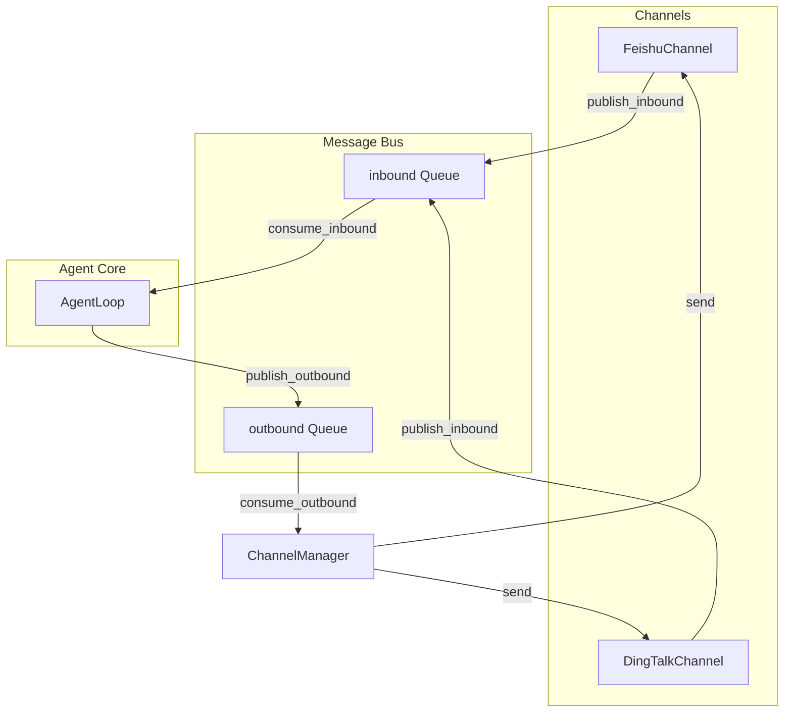

# Phase 4 Multi-Channel Output (Feishu + DingTalk)

> [中文版](PLAN_PHASE4_CHANNELS_CN.md)

## Scope

Implement **bidirectional** multi-channel support (receive messages from Feishu/DingTalk, run Agent, send response back), following the nanobot architecture. All code stays under the `queryclaw` directory.

## Architecture



## Key Design Decisions

1. **Bidirectional**: Full channel support (receive + respond), not outbound-only. Users can ask questions in Feishu/DingTalk and get Agent responses.
2. **Optional dependencies**: Feishu and DingTalk SDKs as extras (`queryclaw[feishu]`, `queryclaw[dingtalk]`) to keep base install small.
3. **Confirmation in channel mode**: Destructive operations (INSERT/UPDATE/DELETE/DDL) will use `confirmation_callback=None` initially, meaning they are **rejected** when `require_confirmation=True`. A future enhancement could add interactive confirmation via channel buttons.

## File Layout

```
queryclaw/
├── bus/
│   ├── __init__.py
│   ├── events.py      # InboundMessage, OutboundMessage
│   └── queue.py       # MessageBus
├── channels/
│   ├── __init__.py
│   ├── base.py        # BaseChannel ABC
│   ├── manager.py     # ChannelManager
│   ├── feishu.py      # FeishuChannel (lark-oapi)
│   └── dingtalk.py    # DingTalkChannel (dingtalk-stream)
├── config/schema.py   # Add FeishuConfig, DingTalkConfig, ChannelsConfig
└── cli/commands.py    # Add `serve` command
```

## Implementation Order

### Batch 1: Bus + Channel Abstraction

1. **Create `queryclaw/bus/`**
   - `events.py`: `InboundMessage`, `OutboundMessage` dataclasses
   - `queue.py`: `MessageBus` with `publish_inbound`, `consume_inbound`, `publish_outbound`, `consume_outbound`
2. **Create `queryclaw/channels/base.py`**
   - `BaseChannel` ABC with `start()`, `stop()`, `send(msg)`, `is_allowed()`, `_handle_message()`
3. **Extend config schema** in `queryclaw/config/schema.py`
   - Add `FeishuConfig` (app_id, app_secret, encrypt_key, verification_token, allow_from)
   - Add `DingTalkConfig` (client_id, client_secret, allow_from)
   - Add `ChannelsConfig` wrapping both
   - Add `channels: ChannelsConfig` to root `Config`

### Batch 2: Feishu Channel

1. **Create `queryclaw/channels/feishu.py`**
   - Use `try/except ImportError` for `lark-oapi`; set `FEISHU_AVAILABLE` flag
   - Inbound: WebSocket long connection via `lark.ws.Client`
   - Outbound: `send()` uses `CreateMessageRequest` with `interactive` card for text
2. **Add optional dependency** in `pyproject.toml`
   - `feishu = ["lark-oapi>=1.5.0,<2.0.0"]`

### Batch 3: DingTalk Channel

1. **Create `queryclaw/channels/dingtalk.py`**
   - Use `try/except ImportError` for `dingtalk-stream`; set `DINGTALK_AVAILABLE` flag
   - Inbound: `DingTalkStreamClient` + `CallbackHandler` for `ChatbotMessage.TOPIC`
   - Outbound: `send()` uses HTTP API `oToMessages/batchSend` with `sampleMarkdown`
2. **Add optional dependency**
   - `dingtalk = ["dingtalk-stream>=0.24.0,<1.0.0", "httpx>=0.28.0"]`

### Batch 4: ChannelManager + Agent Integration

1. **Create `queryclaw/channels/manager.py`**
   - Initialize only Feishu and DingTalk channels based on config
   - `_dispatch_outbound()` loop: consume from bus, route to channel by `msg.channel`
2. **Modify AgentLoop** in `queryclaw/agent/loop.py`
   - Add optional `bus: MessageBus | None` parameter
   - When `bus` is provided: add `run()` method, `_process_message()` for channel mode
   - For channel mode: `confirmation_callback=None`
3. **Add `queryclaw serve` command** in `queryclaw/cli/commands.py`

### Batch 5: Config Loader + Onboard

1. **Update config loader** — ensure `channels` section is loaded
2. **Update onboard command** — add channels section to default config template

## Testing Strategy

- Unit tests: MessageBus publish/consume, BaseChannel.is_allowed
- Integration: Mock Feishu/DingTalk APIs or use test fixtures
- Manual: `queryclaw serve` with real Feishu/DingTalk app credentials
