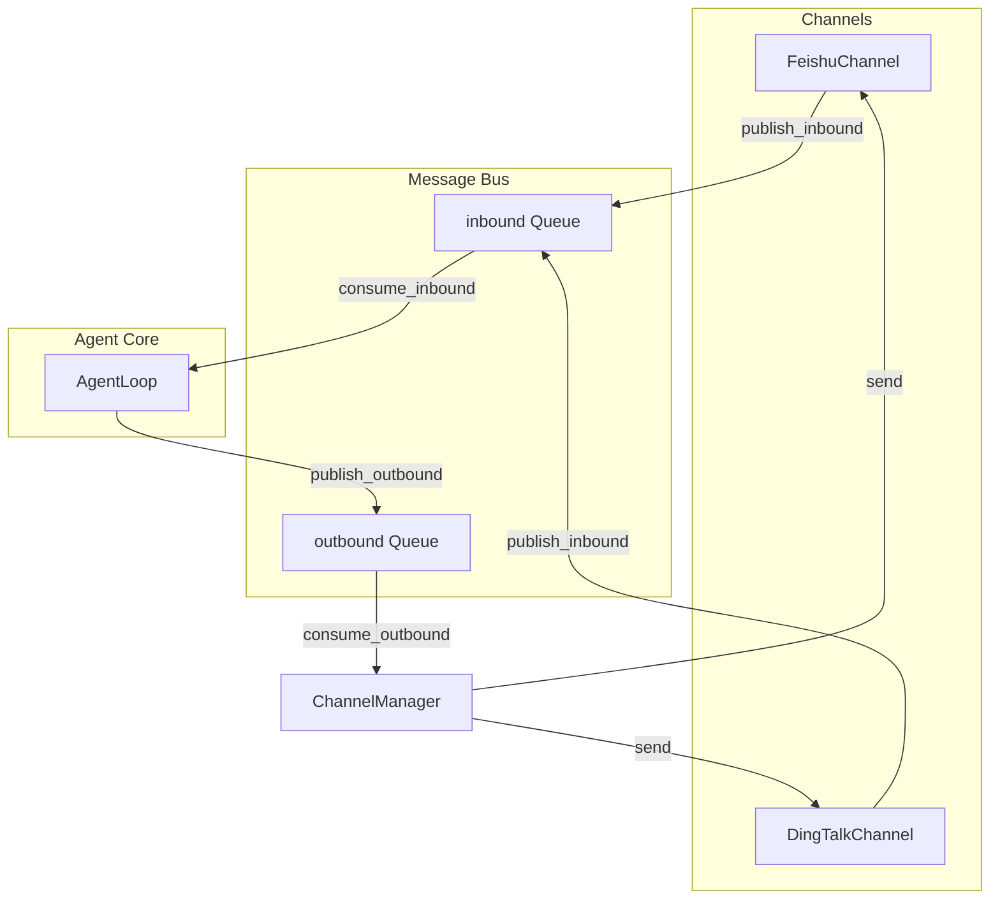

# 阶段四：多通道输出（飞书 + 钉钉）

> [English](PLAN_PHASE4_CHANNELS.md)

## 范围

实现**双向**多通道支持（从飞书/钉钉接收消息、运行 Agent、回发响应），沿用 nanobot 架构。所有代码位于 `queryclaw` 目录下。

## 架构



## 设计要点

1. **双向通信**：完整通道支持（接收 + 回复），而非仅出站。用户可在飞书/钉钉提问并收到 Agent 回复。
2. **可选依赖**：飞书、钉钉 SDK 作为 extras（`queryclaw[feishu]`、`queryclaw[dingtalk]`），保持基础安装精简。
3. **通道模式下的确认**：破坏性操作（INSERT/UPDATE/DELETE/DDL）初期使用 `confirmation_callback=None`，在 `require_confirmation=True` 时将被**拒绝**。后续可通过通道按钮实现交互式确认。

## 文件结构

```
queryclaw/
├── bus/
│   ├── __init__.py
│   ├── events.py      # InboundMessage, OutboundMessage
│   └── queue.py       # MessageBus
├── channels/
│   ├── __init__.py
│   ├── base.py        # BaseChannel ABC
│   ├── manager.py     # ChannelManager
│   ├── feishu.py      # FeishuChannel (lark-oapi)
│   └── dingtalk.py    # DingTalkChannel (dingtalk-stream)
├── config/schema.py   # 新增 FeishuConfig, DingTalkConfig, ChannelsConfig
└── cli/commands.py    # 新增 `serve` 命令
```

## 实现顺序

### 批次 1：Bus + 通道抽象

1. **创建 `queryclaw/bus/`**
2. **创建 `queryclaw/channels/base.py`**
3. **扩展配置 schema**

### 批次 2：飞书通道

4. **创建 `queryclaw/channels/feishu.py`**
5. **添加可选依赖** `feishu = ["lark-oapi>=1.5.0,<2.0.0"]`

### 批次 3：钉钉通道

6. **创建 `queryclaw/channels/dingtalk.py`**
7. **添加可选依赖** `dingtalk = ["dingtalk-stream>=0.24.0,<1.0.0", "httpx>=0.28.0"]`

### 批次 4：ChannelManager + Agent 集成

8. **创建 `queryclaw/channels/manager.py`**
9. **修改 AgentLoop** — 增加 bus 参数、run()、_process_message()
10. **添加 `queryclaw serve` 命令**

### 批次 5：配置加载 + Onboard

11. **更新配置加载器**
12. **更新 onboard 命令**

## 测试策略

- 单元测试：MessageBus publish/consume、BaseChannel.is_allowed
- 集成测试：Mock 飞书/钉钉 API 或使用测试 fixture
- 手动测试：使用真实飞书/钉钉应用凭证运行 `queryclaw serve`
