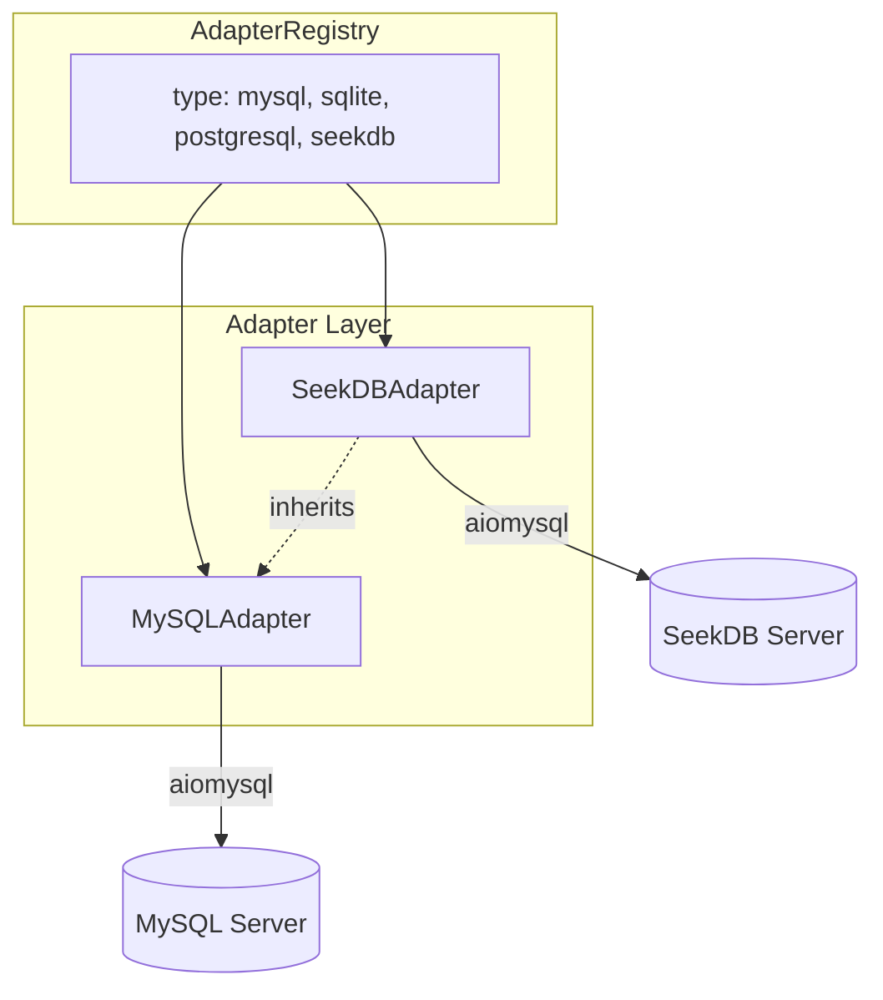

# SeekDB Database Adapter Plan

> [中文版](zh/PLAN_SEEKDB_ADAPTER.md)

## 1. Context

- **SeekDB**: AI-native search database by OceanBase, MySQL protocol compatible
- **Connection**: `mysql -h$host -P$port -u$user -p$password -D$database` (default port 2881)
- **SQL**: Standard MySQL DML/DDL plus extensions (VECTOR type, AI_EMBED, l2_distance, etc.)

## 2. Architecture



## 3. Implementation Steps

### 3.1 Create SeekDBAdapter

**File**: `queryclaw/db/seekdb.py` (new)

Extend `MySQLAdapter`, override:

| Method | Description |
|--------|-------------|
| `db_type` | Return `"seekdb"` |
| `connect()` | Default `port=2881` when not specified |
| `explain()` | SeekDB's EXPLAIN format differs from MySQL. Override to post-process raw result or use `EXPLAIN FORMAT=JSON` and parse, so `DryRunEngine`'s `explain_result.to_text()` works |
| `get_columns()` | When `COLUMN_TYPE` contains `VECTOR`, preserve raw type (e.g. `VECTOR(768)`) in `ColumnInfo.data_type`, so Context shows `embedding: VECTOR(768)` and LLM can generate correct `l2_distance`/`cosine_distance` SQL |

Reuse: `get_tables`, `get_indexes`, `get_foreign_keys`, `execute`, transaction logic.

### 3.2 Register Adapter

**File**: `queryclaw/db/registry.py`

- Import `SeekDBAdapter`
- Add `AdapterRegistry.register("seekdb", SeekDBAdapter)`

### 3.3 Config Schema

**File**: `queryclaw/config/schema.py`

- Extend `DatabaseConfig.type`: `Literal["mysql", "sqlite", "postgresql", "seekdb"]`
- No new fields (host, port, database, user, password same as MySQL)

### 3.4 SeekDB Skill

**File**: `queryclaw/skills/seekdb_vector_search/SKILL.md` (new)

When the user asks for vector search, semantic search, similar documents, or hybrid search, the agent loads this skill. Full content in "SKILL.md Full Text" below.

### 3.5 Documentation

- Add SeekDB to PLAN_ARCHITECTURE, USER_MANUAL (EN + ZH)
- Optional: SEEKDB_SETUP.md — connection example, default port 2881

### 3.6 Tests

**File**: `tests/test_db.py` or new `tests/test_db_seekdb.py`

- Skip if no SeekDB instance (env var or pytest marker)
- Test: create adapter, connect with port 2881, `get_tables`, `execute("SELECT 1")`, `get_columns` preserves VECTOR type
- Reuse MySQL test patterns

### 3.7 Safety Layer

- `queryclaw/safety/validator.py`: No change — SQL dialect is MySQL-compatible
- `queryclaw/safety/dry_run.py`: Relies on adapter `explain()`; SeekDB overrides it

## 4. Config Example

```json
{
  "database": {
    "type": "seekdb",
    "host": "localhost",
    "port": 2881,
    "database": "db1",
    "user": "root",
    "password": "***"
  }
}
```

## 5. SKILL.md Full Text

```markdown
---
description: "SeekDB vector search, semantic search, AI_EMBED, hybrid search"
---
# SeekDB Vector Search

When the user asks for vector search, semantic search, similar documents, or hybrid search in SeekDB, follow these steps:

## 1. Check Schema

- Use `schema_inspect` to list tables and columns
- Identify columns with `VECTOR(dim)` type — these support vector similarity search

## 2. Vector Column and Index

If the table has no vector column yet:

CREATE TABLE t1 (
    id INT PRIMARY KEY,
    doc VARCHAR(500),
    embedding VECTOR(768),
    VECTOR INDEX idx_emb(embedding) WITH (distance=L2, type=hnsw)
);

## 3. Similarity Search

Use `l2_distance` or `cosine_distance` with `ORDER BY ... APPROXIMATE LIMIT k`:

SELECT id, doc FROM t1
ORDER BY l2_distance(embedding, '[0.1,0.2,...]')
APPROXIMATE LIMIT 10;

## 4. AI_EMBED (Text to Vector)

If the user wants to search by natural language, use `AI_EMBED`. Requires model/endpoint registered via `DBMS_AI_SERVICE`:

SELECT id, doc FROM t1
ORDER BY l2_distance(embedding, AI_EMBED('model_name', 'user query text'))
APPROXIMATE LIMIT 10;

## 5. Hybrid Search

Combine keyword filter with vector similarity:

SELECT id, doc FROM t1
WHERE doc LIKE '%keyword%'
ORDER BY l2_distance(embedding, '[...]')
APPROXIMATE LIMIT 10;

## 6. Present Results

- Return the query results clearly
- Explain the search logic if the user asks
```

## 6. Files Summary

| Action | Path |
|--------|------|
| Create | `queryclaw/db/seekdb.py` |
| Create | `queryclaw/skills/seekdb_vector_search/SKILL.md` |
| Edit | `queryclaw/db/registry.py` |
| Edit | `queryclaw/config/schema.py` |
| Edit | `docs/PLAN_ARCHITECTURE.md`, `docs/zh/PLAN_ARCHITECTURE.md` |
| Edit | `docs/USER_MANUAL.md`, `docs/zh/USER_MANUAL.md` |
| Create (optional) | `docs/SEEKDB_SETUP.md`, `docs/zh/SEEKDB_SETUP.md` |
| Edit | `tests/test_db.py` or add `tests/test_db_seekdb.py` |

## 7. Optional Future Enhancements

This release implements: SeekDB adapter, EXPLAIN dialect handling, SeekDB skill, vector-aware schema.

Future work may include: AI_EMBED multi-model/endpoint config management, vector index type selection suggestions, etc.
