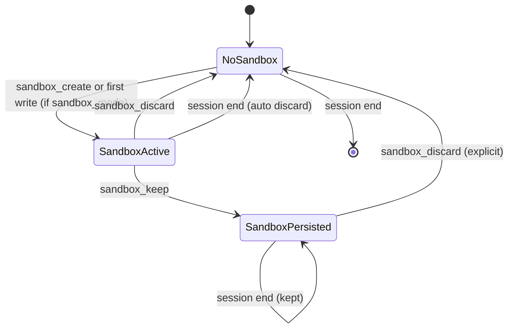

# SeekDB Fork Table Sandbox — Implementation Plan

> [中文版](zh/PLAN_SEEKDB_FORK_SANDBOX.md)

**Status**: Planning  
**Last updated**: 2026-02-27

---

## 1. Background

[SeekDB FORK TABLE](https://www.oceanbase.ai/docs/fork-table-overview) creates an isolated copy of a source table at a consistent snapshot. The forked table is read/write independent. Use cases: A/B testing, sandbox validation, data versioning.

**Key constraints**:
- SeekDB only (MySQL/PostgreSQL/SQLite do not support FORK TABLE)
- Syntax: `FORK TABLE source TO destination`
- Destination must not exist; mutual exclusion with DDL during fork
- Experimental in SeekDB V1.1.0

---

## 2. Architecture Overview

```mermaid
flowchart TB
    subgraph UserLayer [User / Agent]
        UserMsg[User: "UPDATE users SET name='X'"]
    end

    subgraph SandboxLayer [Sandbox Layer - SeekDB only]
        SandboxMgr[SandboxManager]
        ForkMap[table -> fork_name mapping]
    end

    subgraph ToolLayer [Tools]
        QueryExec[query_execute]
        DataModify[data_modify]
        DDLExec[ddl_execute]
    end

    subgraph Rewrite [SQL Rewriting]
        Rewriter[TableNameRewriter]
    end

    UserMsg --> ToolLayer
    ToolLayer --> SandboxMgr
    SandboxMgr -->|"sandbox active?"| ForkMap
    ForkMap --> Rewriter
    Rewriter -->|"UPDATE _qc_sandbox_xxx_users SET..."| SeekDB[(SeekDB)]
```

**Flow**:
1. When sandbox is active, `SandboxManager` holds a mapping: `users` -> `_qc_sandbox_{id}_users`
2. Before executing SQL, rewrite table names in the statement
3. Lazy fork: on first write to a table, run `FORK TABLE users TO _qc_sandbox_{id}_users`
4. Reads (SELECT) also go to the fork when the table is in the sandbox mapping

---

## 3. Design Decisions

| Decision | Choice | Rationale |
|----------|--------|------------|
| **Trigger** | Config + explicit tools | `safety.sandbox_mode=true` for transparent; `sandbox_create` / `sandbox_discard` / `sandbox_keep` for control |
| **Scope** | Session + optional persist | Default: session-scoped, discard on end. User can call `sandbox_keep` to persist |
| **Fork naming** | `_qc_sandbox_{sandbox_id}_{table}` | Unique, avoids collision; prefix `_qc` for QueryClaw |
| **Fork timing** | Lazy | Fork only when first write touches a table; reduces cost |
| **Read behavior** | Redirect to fork | When table is in sandbox, SELECT also uses fork (consistency) |

---

## 4. Component Design

### 4.1 SandboxManager

**Location**: `queryclaw/safety/sandbox.py`

**Responsibilities**:
- Hold `sandbox_id` (UUID) and `table -> fork_name` mapping per sandbox
- `fork_table_if_needed(table)` — run `FORK TABLE table TO fork_name` when table not yet forked
- `rewrite_sql(sql)` — replace table names in SQL using mapping (sqlglot AST or regex)
- `get_fork_name(table)` — return fork name or None
- `discard()` — `DROP TABLE` all forks
- `keep()` — persist sandbox_id; do not DROP on session end

**Session binding**: SandboxManager is created per AgentLoop (or per session in channel mode). Stored in `AgentLoop._sandbox` when `sandbox_mode=True` and `db_type=seekdb`.

### 4.2 SQL Table Rewriting

**Approach**: Use sqlglot to parse SQL, walk AST, replace `Table` nodes where `table.name` is in the mapping. Fallback: regex for simple cases.

**Edge cases**:
- Aliases: `FROM users u` — rewrite `users` to fork; alias `u` stays
- Subqueries: `SELECT * FROM (SELECT * FROM users) t` — rewrite inner `users`
- Qualified names: `db.users` — rewrite table part

**New module**: `queryclaw/safety/sql_rewriter.py` — `rewrite_table_names(sql: str, mapping: dict[str, str], dialect: str) -> str`

### 4.3 Tool Integration

**Affected tools**: `query_execute`, `data_modify`, `ddl_execute`, `explain_plan`

**Pattern**: Before `await self._db.execute(sql)`:
```python
if self._sandbox and self._db.db_type == "seekdb":
    sql = self._sandbox.rewrite_sql(sql)
    for table in validation.tables_affected:
        await self._sandbox.fork_table_if_needed(table)
```

**Injection**: SandboxManager is passed into tools that need it. When `sandbox_mode=False` or `db_type != "seekdb"`, `_sandbox` is None and no rewriting.

### 4.4 New Tools

| Tool | Purpose |
|------|---------|
| `sandbox_create` | Create a new sandbox (fork nothing yet; lazy fork on first write). Returns sandbox_id |
| `sandbox_discard` | DROP all fork tables for current sandbox; clear mapping |
| `sandbox_keep` | Mark sandbox as persistent; do not auto-discard on session end |
| `sandbox_status` | Show which tables are forked, sandbox_id, persist flag |

When `sandbox_mode=true` (config), sandbox is auto-created at first write. Tools allow explicit create/discard/keep.

### 4.5 Config & SafetyConfig

**Schema** ([config/schema.py](queryclaw/queryclaw/config/schema.py)):
```python
# In SafetyConfig
sandbox_mode: bool = False  # When True + SeekDB, writes go to forks
sandbox_auto_create: bool = True  # Auto-create sandbox on first write when sandbox_mode=True
```

---

## 5. Context & Schema Injection

**Behavior**: `ContextBuilder` injects schema. When sandbox is active, we do **not** change the schema view — Agent still sees `users`, `orders`, etc. The rewrite happens at execution. This keeps the Agent's mental model simple.

**Optional**: Add one line to context when sandbox active: `"(Sandbox active: writes and reads use isolated table copies.)"`

---

## 6. Session Lifecycle



**Channel mode**: Session ID from `session_id` in message context (e.g. Feishu `open_id` + thread). SandboxManager keyed by session_id.

---

## 7. Limitations & Considerations

| Limitation | Mitigation |
|------------|------------|
| SeekDB only | Check `db_type == "seekdb"`; no-op for other DBs |
| FORK TABLE experimental | Document; optional feature |
| FK / multi-table | Fork each table on first touch; FK refs stay valid (same PKs in fork) |
| DDL on fork | ALTER/DROP on "users" in sandbox → operate on fork |
| Promote (copy back) | Out of scope for v1; document manual workflow |

---

## 8. File Changes Summary

| File | Change |
|------|--------|
| `queryclaw/safety/sandbox.py` | **New** — SandboxManager |
| `queryclaw/safety/sql_rewriter.py` | **New** — Table name rewriting |
| `queryclaw/tools/sandbox.py` | **New** — sandbox_create, sandbox_discard, sandbox_keep, sandbox_status |
| `queryclaw/config/schema.py` | Add `sandbox_mode`, `sandbox_auto_create` to SafetyConfig |
| `queryclaw/tools/query.py` | Inject SandboxManager; rewrite SQL before execute |
| `queryclaw/tools/modify.py` | Inject SandboxManager; fork on write, rewrite SQL |
| `queryclaw/tools/ddl.py` | Inject SandboxManager; rewrite SQL for DDL on sandbox tables |
| `queryclaw/tools/explain.py` | Inject SandboxManager; rewrite SQL |
| `queryclaw/agent/loop.py` | Create SandboxManager when seekdb + sandbox_mode; pass to tools; session cleanup |
| `queryclaw/agent/context.py` | Optional sandbox hint in context |
| `queryclaw/skills/seekdb_fork_sandbox/SKILL.md` | **New** — Skill for sandbox workflow guidance |

---

## 9. Implementation Order

1. **sql_rewriter.py** — Pure function, unit testable
2. **sandbox.py (SandboxManager)** — Core logic, depends on db adapter
3. **Config** — SafetyConfig fields
4. **Tool wiring** — Pass SandboxManager into query, modify, ddl, explain
5. **sandbox tools** — sandbox_create, sandbox_discard, sandbox_keep, sandbox_status
6. **AgentLoop** — Create SandboxManager, session binding, cleanup
7. **Skill** — seekdb_fork_sandbox SKILL.md
8. **Tests** — Unit tests for rewriter, integration tests for sandbox flow (skip if no SeekDB)

---

## 10. Skill: seekdb_fork_sandbox

When user asks for sandbox, safe experimentation, or "try changes without affecting production":

1. Check `db_type == seekdb`; if not, explain FORK TABLE is SeekDB-only
2. If sandbox_mode in config, explain it's already on
3. Otherwise, guide: call `sandbox_create`, then run experiments (data_modify, ddl_execute)
4. When done: `sandbox_discard` to clean up, or `sandbox_keep` to retain
5. Note: FORK TABLE is experimental in SeekDB V1.1.0
