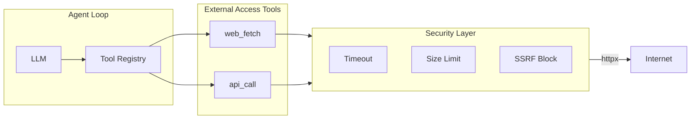

# QueryClaw 外网访问能力设计

> 英文版：[DESIGN_EXTERNAL_ACCESS.md](../DESIGN_EXTERNAL_ACCESS.md)

## 目标

让 Agent 能够抓取网页、调用 REST API，并可选择支持网页搜索，用于：用外部数据丰富数据库记录、校验 URL、获取参考文档等场景。

## 架构



## 1. 新增工具

### 1.1 `web_fetch`

从 URL 获取内容，返回纯文本（可去除 HTML 标签）或解析后的 JSON。

| 参数 | 类型 | 必填 | 说明 |
|------|------|------|------|
| `url` | string | 是 | 要抓取的 URL |
| `format` | enum | 否 | `"text"`（默认，去除 HTML 标签）、`"json"`（解析为 JSON）或 `"raw"` |
| `max_chars` | integer | 否 | 返回内容的最大字符数（默认 10000） |

**示例场景**：
- 「抓取 https://example.com/api/v1/docs 的 API 文档并总结接口」
- 「从 https://api.exchangerate.host/latest 获取当前汇率」

### 1.2 `api_call`

通用 REST API 调用，支持指定方法、请求头和请求体。

| 参数 | 类型 | 必填 | 说明 |
|------|------|------|------|
| `url` | string | 是 | API 端点 URL |
| `method` | enum | 否 | `GET`、`POST`、`PUT`、`PATCH`、`DELETE`（默认 GET） |
| `headers` | object | 否 | 可选请求头 |
| `body` | object/string | 否 | 请求体（JSON 或字符串） |
| `max_chars` | integer | 否 | 响应内容最大字符数（默认 10000） |

**示例场景**：
- 「调用天气 API 获取北京今日预报」
- 「向我们的 webhook 发送 POST 通知迁移完成」

### 1.3 `web_search`（可选，Phase 2）

网页搜索并返回摘要。需要配置 API Key（如 Serper、Bing 等）。

| 参数 | 类型 | 必填 | 说明 |
|------|------|------|------|
| `query` | string | 是 | 搜索关键词 |
| `num_results` | integer | 否 | 返回结果数量（默认 5） |

## 2. 安全层

### 2.1 其他防护

| 防护项 | 默认值 | 用途 |
|--------|--------|------|
| `timeout_seconds` | 10 | 超时中断长时间请求 |
| `max_response_chars` | 50000 | 限制响应大小，避免撑爆上下文 |
| `block_local` | true | 禁止 127.0.0.1、localhost、10.x、192.168.x（防 SSRF） |
| `block_file` | true | 禁止 `file://` URL |

### 2.2 SSRF 防护

- 拒绝解析到内网 IP 的 URL
- 拒绝 `file://`、`ftp://`（如不需要）
- 使用 `httpx` 的 `follow_redirects=True`，校验最终 URL 非内网/本地

### 2.3 TODO：域名白名单（后续）

- **暂不实现**：Phase 1 不包含域名白名单（`allowed_domains`）
- 后续实现：仅允许白名单中的域名被访问
- 用途：生产环境限制可访问的 API/文档

## 3. 配置

### 3.1 配置结构

在 [config/schema.py](../queryclaw/config/schema.py) 中新增：

```python
class ExternalAccessConfig(Base):
    """外网访问配置。"""

    enabled: bool = False
    timeout_seconds: int = 10
    max_response_chars: int = 50000
    block_local: bool = True
    block_file: bool = True
    # TODO: allowed_domains: list[str] — 域名白名单（后续）
```

在根配置中增加：

```python
external_access: ExternalAccessConfig = Field(default_factory=ExternalAccessConfig)
```

### 3.2 配置示例

```json
{
  "external_access": {
    "enabled": true,
    "timeout_seconds": 10,
    "max_response_chars": 50000
  }
}
```

## 4. 实现文件

| 文件 | 用途 |
|------|------|
| `queryclaw/tools/web_fetch.py` | `WebFetchTool` — 抓取 URL，返回文本/JSON |
| `queryclaw/tools/api_call.py` | `ApiCallTool` — REST API 调用 |
| `queryclaw/safety/external.py` | `ExternalAccessPolicy` — URL 校验、SSRF 检查（白名单：TODO） |
| `queryclaw/config/schema.py` | 新增 `ExternalAccessConfig` |
| `queryclaw/agent/loop.py` | 仅在 `external_access.enabled` 时注册工具 |

### 4.1 工具注册

在 [loop.py](../queryclaw/agent/loop.py) 的 `_register_default_tools()` 中：

```python
# 在现有工具之后...
if getattr(self.config, "external_access", None) and self.config.external_access.enabled:
    policy = ExternalAccessPolicy(self.config.external_access)
    self.tools.register(WebFetchTool(policy))
    self.tools.register(ApiCallTool(policy))
```

说明：`AgentLoop` 当前只接收 `safety_policy`，不接收完整 config。需要传入 `external_access` 配置，可通过扩展 `SafetyPolicy` 或新增 `AgentLoop` 参数实现。

### 4.2 ExternalAccessPolicy

```python
# queryclaw/safety/external.py
class ExternalAccessPolicy:
    def __init__(self, config: ExternalAccessConfig): ...
    def is_allowed(self, url: str) -> tuple[bool, str]:  # (是否允许, 原因)
    def _check_ssrf(self, parsed: urllib.parse.ParseResult) -> bool
    # TODO: def _check_allowlist(self, host: str) -> bool
```

## 5. 上下文 / 系统提示词

启用外网工具时，在系统提示词（[context.py](../queryclaw/agent/context.py) 或 identity 段）中增加：

```
## 外网访问（如已启用）
- `web_fetch` — 抓取 URL 内容（文本或 JSON）
- `api_call` — 发起 REST API 调用（GET、POST 等）
```

## 6. 依赖

- `httpx` — 已用于 Feishu/DingTalk 通道，可直接用于 `web_fetch` 和 `api_call`
- 若 `httpx` 已是依赖，则无需新增可选 extras；否则可增加 `queryclaw[external]` 并包含 `httpx`

## 7. 审计（可选）

可将外网调用记录到审计表，便于合规：

- `operation_type`: `web_fetch` / `api_call`
- `sql_text`: URL（或空）
- `metadata`: `{"url": "...", "status_code": 200, "response_size": 1234}`

## 8. 阶段规划

| 阶段 | 范围 | 工作量 |
|------|------|--------|
| 1 | `web_fetch` + `api_call` + SSRF 防护 | 中 |
| 2 | `web_search`（Serper/Bing API） | 低 |
| 3 | 外网调用的审计日志 | 低 |
| 4 | 域名白名单（`allowed_domains`） | 低 |

## 9. 设计要点

- **默认关闭**：`enabled: false`，用户需显式开启
- **Phase 1 无白名单**：启用后允许访问所有公网 URL；域名白名单放入 TODO
- **复用 httpx 客户端**：沿用 channels 中已有的 `httpx.AsyncClient` 用法
- **Token 控制**：`max_response_chars` 限制响应大小，避免撑爆 LLM 上下文
