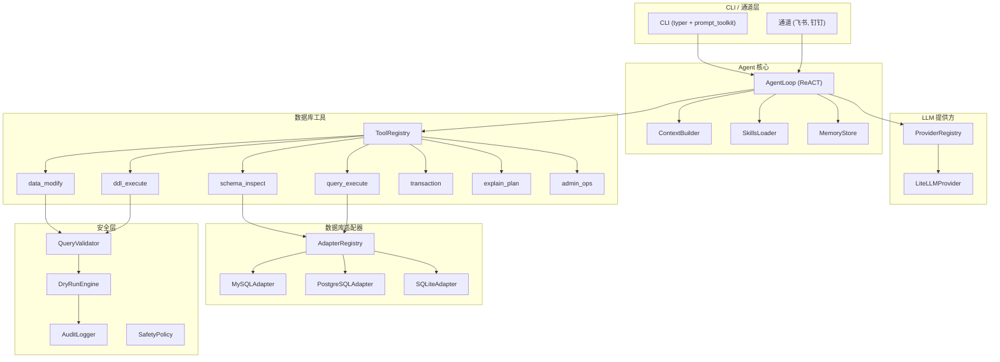

# QueryClaw：AI 原生数据库 Agent —— 架构与实施计划（中文版）

> English version: [PLAN_ARCHITECTURE.md](PLAN_ARCHITECTURE.md)

## 1. 核心概念

**openclaw : 操作系统 = queryclaw : 数据库**

openclaw 让 LLM 控制一台个人电脑；queryclaw 让 LLM 控制一个数据库实例。用户将完整数据库（MySQL / PostgreSQL / SQLite）交给 Agent，由 Agent 自主完成：探索表结构、查询数据、修改记录、优化性能、执行管理任务等，全部通过自然语言完成。

## 2. 架构概览

参考 [nanobot](nanobot/nanobot/) 设计，针对数据库领域做适配：



## 3. 目录结构

```
queryclaw/
├── queryclaw/
│   ├── __init__.py
│   ├── agent/
│   │   ├── loop.py          # ReACT 主循环 (参考 nanobot/agent/loop.py)
│   │   ├── context.py       # 系统提示与 schema 上下文构建
│   │   ├── memory.py        # 对话与操作记忆
│   │   └── skills.py        # 技能加载 (SKILL.md 格式)
│   ├── providers/
│   │   ├── base.py          # LLMProvider 抽象基类
│   │   ├── registry.py      # 提供方自动检测注册表
│   │   └── litellm_provider.py  # LiteLLM 统一后端
│   ├── tools/
│   │   ├── base.py          # Tool 抽象基类
│   │   ├── registry.py      # ToolRegistry
│   │   ├── schema.py        # schema_inspect, schema_search
│   │   ├── query.py         # query_execute (SELECT)
│   │   ├── modify.py        # data_modify (INSERT/UPDATE/DELETE)
│   │   ├── ddl.py           # ddl_execute (CREATE/ALTER/DROP)
│   │   ├── transaction.py   # begin/commit/rollback
│   │   ├── explain.py       # EXPLAIN / 执行计划分析
│   │   └── admin.py         # 库级管理 (用户、权限、统计)
│   ├── db/
│   │   ├── base.py          # DatabaseAdapter 抽象基类
│   │   ├── registry.py      # 按数据库类型注册适配器
│   │   ├── mysql.py         # MySQL 适配器
│   │   ├── postgresql.py    # PostgreSQL 适配器
│   │   └── sqlite.py        # SQLite 适配器
│   ├── safety/
│   │   ├── validator.py    # 基于 AST 的 SQL 校验
│   │   ├── policy.py        # 安全策略 (只读/白名单等)
│   │   ├── dry_run.py       # 试跑引擎 (EXPLAIN + 影响行数)
│   │   └── audit.py         # 审计日志 (前后快照)
│   ├── config/
│   │   ├── schema.py        # Pydantic 配置模型
│   │   └── loader.py        # 配置加载 (~/.queryclaw/config.json)
│   ├── bus/                 # 消息总线（阶段四）
│   │   ├── events.py        # 事件类型
│   │   └── queue.py         # 内存事件队列
│   ├── channels/            # 输出通道（阶段四）
│   │   ├── base.py          # BaseChannel 抽象基类
│   │   ├── manager.py       # ChannelManager
│   │   ├── feishu.py        # 飞书通道
│   │   └── dingtalk.py      # 钉钉通道
│   ├── cli/
│   │   └── commands.py      # typer CLI (chat, onboard, serve)
│   └── skills/              # 内置技能 (SKILL.md；详见 SKILLS_ROADMAP)
│       ├── ai_column/
│       ├── test_data_factory/
│       ├── schema_documenter/
│       ├── data_detective/
│       ├── query_translator/
│       ├── index_advisor/
│       ├── data_healer/
│       ├── smart_migrator/
│       └── ...               # + 异常探测器、数据脱敏等
├── pyproject.toml
├── README.md
└── LICENSE
```

## 4. 核心组件（参考 nanobot 并适配）

### 4.1 数据库适配层 (`queryclaw/db/`)

可扩展的多数据库支持。**阶段一优先支持 MySQL + SQLite**（MySQL 为首要目标，SQLite 用于零配置测试与演示），PostgreSQL 后移。

适配层采用**两层抽象**，为未来支持非关系型数据库（如 MongoDB、Redis、Elasticsearch）预留扩展空间：

```python
class DatabaseAdapter(ABC):
    """通用适配器接口 —— 所有数据库类型均需实现"""
    async def connect(self, config: DBConfig) -> None
    async def execute(self, command: str, params=None) -> QueryResult
    async def get_structure(self) -> StructureInfo       # 库/表/集合等
    async def close(self) -> None
    @property
    def db_type(self) -> str  # "mysql", "sqlite", "mongodb", ...

class SQLAdapter(DatabaseAdapter):
    """SQL 特化层 —— 关系型数据库的通用方法"""
    async def get_schemas(self) -> list[SchemaInfo]
    async def get_tables(self, schema: str) -> list[TableInfo]
    async def get_columns(self, table: str) -> list[ColumnInfo]
    async def get_indexes(self, table: str) -> list[IndexInfo]
    async def get_foreign_keys(self, table: str) -> list[FKInfo]
    async def explain(self, sql: str) -> ExplainResult
    async def begin_transaction(self) -> TransactionHandle

# 未来非 SQL 数据库可实现独立特化层
# class DocumentAdapter(DatabaseAdapter): ...  # MongoDB
# class KVAdapter(DatabaseAdapter): ...        # Redis
```

用户在 `~/.queryclaw/config.json` 中配置数据库类型与连接信息：

```json
{
  "database": {
    "type": "mysql",
    "host": "localhost",
    "port": 3306,
    "database": "myapp",
    "user": "root",
    "password": "***"
  }
}
```

### 4.2 Agent ReACT 循环 (`queryclaw/agent/loop.py`)

与 `nanobot/agent/loop.py` 同构：

- **推理**：LLM 接收用户请求 + schema 上下文 + 对话历史
- **行动**：LLM 调用数据库工具（查 schema、执行查询、改数据等）
- **观察**：工具结果回传给 LLM
- **循环**直至 LLM 给出最终回答（不再发起工具调用）

### 4.3 数据库工具 (`queryclaw/tools/`)

| 工具 | 说明 | 安全级别 |
|------|------|----------|
| `schema_inspect` | 列出库/schema/表/列/索引/外键 | 安全（只读） |
| `query_execute` | 执行 SELECT，返回结果 | 安全（只读） |
| `explain_plan` | 对查询做 EXPLAIN，展示执行计划 | 安全（只读） |
| `data_modify` | INSERT/UPDATE/DELETE（经安全层） | 需校验 |
| `ddl_execute` | CREATE/ALTER/DROP（经安全层） | 需校验 |
| `transaction` | BEGIN/COMMIT/ROLLBACK | 视上下文 |
| `admin_ops` | 用户管理、权限、库统计 | 高权限 |

### 4.4 安全层 (`queryclaw/safety/`)

分层安全：

1. **策略检查**：该操作类型是否允许？（可配置：只读 / 读写 / 全量）
2. **SQL 校验**：解析 SQL AST，识别危险模式（如 DROP DATABASE、无 WHERE 的 DELETE）
3. **试跑**：对语句做 EXPLAIN，估算影响行数，展示执行计划
4. **人工确认**：破坏性操作前提示「将删除 1,234 行，是否继续？[y/N]」
5. **事务包裹**：修改类操作自动包在事务中，出错即回滚
6. **审计日志**：记录前后快照与完整 SQL 血缘

### 4.5 LLM 提供方 (`queryclaw/providers/`)

直接沿用 nanobot 的提供方模式：

- `LLMProvider` 抽象基类，提供 `chat()` 方法
- `LiteLLMProvider` 统一多提供方
- `ProviderRegistry` 按模型名 / API Key 自动检测
- 用户在 `~/.queryclaw/config.json` 中配置

### 4.6 技能系统 (`queryclaw/skills/`)

技能采用 SKILL.md 格式（与 nanobot 一致）。每个技能对应一套领域工作流，供 Agent 按场景调用。完整目录与优先级见 [SKILLS_ROADMAP.md](SKILLS_ROADMAP.md)；下表为阶段映射。

**按工作阶段：**

| 阶段 | 技能 |
|------|------|
| **开发** | AI 列、测试数据工厂、Schema 文档生成、API 脚手架 |
| **排查与调试** | 数据侦探、查询翻译器 |
| **数据质量与治理** | 数据修复师、数据脱敏、异常探测器 |
| **性能与运维** | 索引顾问、变更影响分析、容量规划师 |
| **合规与安全** | 合规扫描器、权限审计 |
| **迁移与演进** | 智能迁移器、跨库同步检查 |

**优先级与建议阶段：**

| 优先级 | 技能 | 阶段 | 价值 |
|--------|------|------|------|
| 高 | AI 列、测试数据工厂、数据侦探、Schema 文档生成 | 二 | 核心差异化；开发者日常 |
| 中 | 查询翻译器 | 二 | 低成本高价值 |
| 中 | 索引顾问、数据修复师、异常探测器、数据脱敏、智能迁移器 | 三 | 数据治理、运维 |
| 低 | 变更影响分析 | 三 | 进阶运维 |
| 低 | 容量规划师、合规扫描器、权限审计、API 脚手架 | 五 | 企业 / DBA |
| 低 | 跨库同步检查 | 五 | 多库支持后 |

## 5. 把数据库交给 Agent 后能做什么？

这是探索性核心。计划先实现的能力包括：

- **自然语言查询**：「显示上季度按收入排序的前 10 名客户」
- **Schema 探索**：「与订单系统相关的表有哪些？展示 ER 关系」
- **数据分析**：「本周交易数据里有没有异常？」
- **安全数据修改**：「把所有过期订阅用户更新为未激活状态」（配合试跑 + 确认）
- **Schema 演进**：「给 users 表增加 last_login 列」（配合迁移计划）
- **性能诊断**：「这条查询为什么慢？」（EXPLAIN + 索引建议）
- **数据质量检查**：发现孤岛记录、重复、NULL 违规
- **报表生成**：「按地区生成月度销售汇总」
- **备份与恢复**：「在改表前为 orders 表建一份快照」
- **权限审计**：「列出所有数据库用户及其权限」

## 6. 高级功能分析（参考 nanobot）

深入研究 nanobot 后，以下高级特性值得在 queryclaw 中引入：

### 已实现

#### A. 子代理系统（后台长任务）
- **实现**：`spawn_subagent` 工具（阶段二）

#### E. 消息总线 + 多通道输出
- **实现**：飞书、钉钉通道，`queryclaw serve`（阶段四）

#### H. 数据血缘追踪
- **实现**：审计表 `_queryclaw_audit_log`，前后快照（阶段二）

### 近期可引入（阶段三）

#### B. 记忆系统（Schema 知识 + 操作历史）
- **来源**：nanobot 的 `MemoryStore`，双层架构（MEMORY.md + HISTORY.md）
- **数据库场景**：
  - `MEMORY.md`：记住学到的 schema 知识、表间关系、业务含义（如「orders.status=3 表示已完成」）
  - `HISTORY.md`：记录执行过的重要查询和操作，便于回溯与审计
- **优势**：Agent 跨会话「记住」数据库结构，无需每次重新探索

#### C. 定时任务系统（Cron）
- **来源**：nanobot 的 `CronService`，支持 `at`/`every`/`cron` 三种调度方式
- **数据库场景**：定期健康检查、性能监控、数据质量巡检
- **示例**：
  - 「每天早上 9 点检查是否有超过 100 万行的表缺失索引」
  - 「每周一生成上周的销售汇总报表」

#### D. 主动唤醒（Heartbeat）
- **来源**：nanobot 的 `HeartbeatService`，定期检查 HEARTBEAT.md，由 LLM 决定是否需要行动
- **数据库场景**：Agent 定期巡查数据库状态，发现异常主动通知
- **示例**：磁盘空间不足、慢查询飙升、死锁频发 → 主动报告

### 远期可探索（阶段五+）

#### F. MCP 服务模式
- 将 queryclaw 暴露为 MCP Server，其他 Agent（Cursor、Claude）直接调用
- 其他 Agent 需要查数据时问 queryclaw，无需自己写 SQL

#### G. 多数据库同时连接
- 一个 queryclaw 实例连接多个库（如生产 MySQL + 分析 PostgreSQL + 缓存 Redis）
- Agent 可做跨库分析：「对比 MySQL 生产库和 PostgreSQL 分析库里 users 表的数据差异」

#### I. 自然语言到存储过程/视图
- Agent 不仅执行一次性查询，还能将常用查询固化为存储过程或视图
- 「把这个查询保存为每月销售视图」

#### J. 数据库迁移编排
- 分析现有 schema，生成安全的迁移脚本
- 支持 dry-run 预览、回滚方案自动生成

#### K. 智能索引顾问
- 分析慢查询日志，结合 EXPLAIN，自动建议索引策略
- 模拟添加索引后的性能提升

---

## 7. 多数据库扩展路线

当前计划覆盖关系型数据库（MySQL → SQLite → PostgreSQL）。适配层的两层抽象（`DatabaseAdapter` + `SQLAdapter`）为未来扩展到非关系型数据库预留了空间：

| 数据库类型 | 计划阶段 | 适配层 | 说明 |
|-----------|---------|--------|------|
| **MySQL** | 阶段一（首要） | `SQLAdapter` | 最常用的生产数据库 |
| **SQLite** | 阶段一 | `SQLAdapter` | 零配置，开发/测试/演示用 |
| **PostgreSQL** | 阶段二~三 | `SQLAdapter` | 生态丰富，高级 SQL 特性 |
| **MongoDB** | 阶段五 | `DocumentAdapter` | 文档型，MQL 代替 SQL |
| **Redis** | 阶段五 | `KVAdapter` | Key-Value，命令式交互 |
| **Elasticsearch** | 远期 | `SearchAdapter` | 全文搜索与分析 |
| **ClickHouse** | 远期 | `SQLAdapter` | 列存分析 |

**非 SQL 数据库的设计要点**：
- Agent 的工具不直接绑定 SQL，而是表达「意图」（探索结构、查询数据、修改数据）
- 适配器将意图翻译为对应的数据库操作（SQL / MQL / Redis 命令 / DSL）
- 安全层需要按数据库类型做「方言化」校验

---

### 7.1 向量数据库与 AI 原生数据库（阶段五+）

与向量库、AI 原生库结合可形成差异化亮点：

| 方向 | 亮点 | 依赖 |
|------|------|------|
| **向量 + Schema** | 语义找表/列（RAG over schema + 文档），大库更稳 | 向量存储（pgvector / 专用向量库） |
| **向量 + 查询** | 混合查询：SQL 过滤 + 向量相似度 | 库内或侧挂向量索引 |
| **向量 + 记忆** | 记忆向量化，语义回忆历史，越用越聪明 | 记忆表 + embedding 或向量库 |
| **向量 + AI 列** | 一键生成 embedding 列，支持相似搜索/去重/聚类 | 模型 API + 向量列类型 |
| **AI 原生库** | 统一 Agent 入口，库当执行器；复杂任务用 QueryClaw 编排 | 各库 NL/AI API 的适配器 |
| **AI 原生库** | 技能层 + 统一记忆/审计，补足库本身没有的工作流 | 现有架构扩展 |

**实现要点**：
- 适配器支持向量列或对接向量库（如 pgvector、Milvus、Chroma）；工具层增加 `schema_search_semantic`、混合查询等。
- AI 原生库（AlloyDB AI、Oracle Select AI、Snowflake Cortex 等）封装为可选工具，与自有 ReACT 工具并存；记忆与审计仍由 QueryClaw 统一写入主库。

---

## 8. 实施阶段（更新版）

### 阶段一：MVP —— 只读 Agent *（已完成）*

搭建主循环 + 只读数据库工具：

- CLI 交互式对话（typer + prompt_toolkit）
- ReACT Agent 循环（沿用 nanobot 模式）
- LLM 提供方层（LiteLLM）
- 数据库适配层（**优先 MySQL + SQLite**）
- 工具：`schema_inspect`、`query_execute`、`explain_plan`
- 基础配置系统
- 基础技能加载

### 阶段二：写操作 + 安全 + PostgreSQL *（已完成）*

- 工具：`data_modify`、`ddl_execute`、`transaction`
- 安全层：校验器、试跑、审计日志
- 破坏性操作的人机确认
- PostgreSQL 适配器
- 子代理系统（后台长任务）
- 首批技能（高优先级）：AI 列、测试数据工厂、数据侦探、Schema 文档生成；查询翻译器（中）

### 阶段三：高级技能 + 记忆 + 定时任务

- 技能：索引顾问、数据修复师、异常探测器、数据脱敏、智能迁移器；变更影响分析（低）
- 持久记忆（操作历史、学到的 Schema 知识）
- 定时任务系统（Cron）+ 主动唤醒（Heartbeat）
- 复杂任务的多步规划

### 阶段四：多通道输出（已实现）

- 消息总线 + 双向通道（飞书、钉钉）
- `queryclaw serve` — 通道模式下运行 Agent；在飞书/钉钉中提问并接收回复
- 可选依赖：`queryclaw[feishu]`、`queryclaw[dingtalk]`
- 通道模式下，当 `require_confirmation=True` 时拒绝破坏性操作
- 详见 [PLAN_PHASE4_CHANNELS.md](PLAN_PHASE4_CHANNELS.md)

### 阶段五：生态集成

- MCP 服务模式（对外暴露为 MCP 工具）
- 更多通道（Telegram、Slack 等）
- MongoDB 适配器
- 多数据库同时连接
- 技能（低优先级）：容量规划师、合规扫描器、权限审计、API 脚手架；跨库同步检查（阶段五）
- Web UI（可选）
- 自定义工具/适配器插件体系

### 阶段五+：向量与 AI 原生数据库

- 向量存储/向量列支持（pgvector 或侧挂向量库）；语义 Schema 检索、混合查询、记忆向量化
- AI 列扩展：生成 embedding 列
- AI 原生库适配器（封装库自带 NL/AI 能力）；统一记忆与审计

---

## 待办（阶段一）*（已全部完成）*

详见 [PLAN_PHASE1_ARCHIVE.md](PLAN_PHASE1_ARCHIVE.md)。
