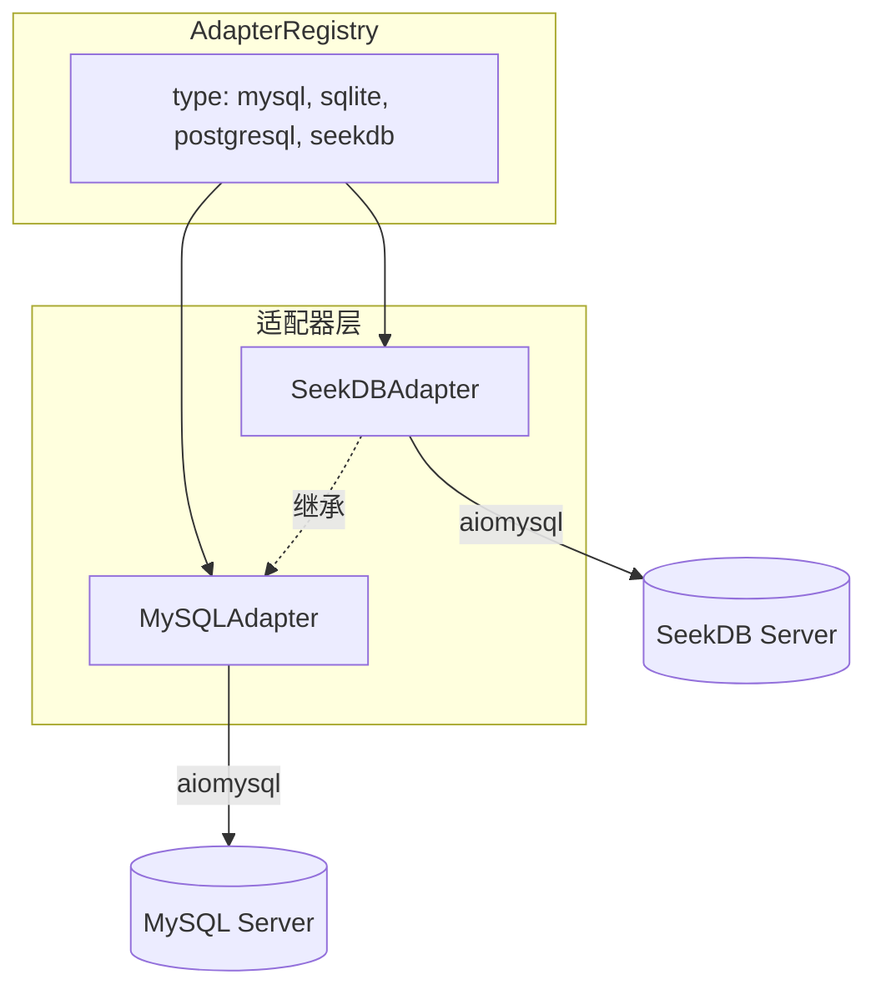

# SeekDB 数据库适配器规划

> [English](../PLAN_SEEKDB_ADAPTER.md)

## 1. 背景

- **SeekDB**：OceanBase 推出的 AI 原生搜索数据库，协议兼容 MySQL
- **连接方式**：`mysql -h$host -P$port -u$user -p$password -D$database`（默认端口 2881）
- **SQL**：标准 MySQL DML/DDL，外加扩展（VECTOR 类型、AI_EMBED、l2_distance 等）

## 2. 架构



## 3. 实现步骤

### 3.1 创建 SeekDBAdapter

**文件**：`queryclaw/db/seekdb.py`（新建）

继承 `MySQLAdapter`，重写以下方法：

| 方法 | 说明 |
|------|------|
| `db_type` | 返回 `"seekdb"` |
| `connect()` | 未指定 `port` 时默认 `2881` |
| `explain()` | SeekDB 的 EXPLAIN 输出格式与 MySQL 不同，需重写。方案：执行 `EXPLAIN {sql}` 后对结果做后处理，或使用 `EXPLAIN FORMAT=JSON` 解析并转为 `QueryResult`，使 `DryRunEngine` 的 `explain_result.to_text()` 可用 |
| `get_columns()` | 当 `COLUMN_TYPE` 含 `VECTOR` 时，在 `ColumnInfo.data_type` 中保留原始类型（如 `VECTOR(768)`），使 Context 注入的 schema 显示 `embedding: VECTOR(768)`，LLM 能识别向量列并生成正确的 `l2_distance`、`cosine_distance` SQL |

复用：`get_tables`、`get_indexes`、`get_foreign_keys`、`execute`、事务逻辑。

### 3.2 注册适配器

**文件**：`queryclaw/db/registry.py`

- 导入 `SeekDBAdapter`
- 添加 `AdapterRegistry.register("seekdb", SeekDBAdapter)`

### 3.3 配置 Schema

**文件**：`queryclaw/config/schema.py`

- 扩展 `DatabaseConfig.type`：`Literal["mysql", "sqlite", "postgresql", "seekdb"]`
- 无需新增字段（host、port、database、user、password 与 MySQL 相同）

### 3.4 SeekDB 技能

**文件**：`queryclaw/skills/seekdb_vector_search/SKILL.md`（新建）

当用户询问向量搜索、语义搜索、相似文档、混合搜索时，Agent 加载此技能。完整内容见下方「SKILL.md 全文」。

### 3.5 文档更新

- `docs/PLAN_ARCHITECTURE.md`、`docs/zh/PLAN_ARCHITECTURE.md`：在多数据库路线表中加入 SeekDB
- `docs/USER_MANUAL.md`、`docs/zh/USER_MANUAL.md`：数据库列表和配置示例中加入 SeekDB
- 可选：`docs/SEEKDB_SETUP.md`、`docs/zh/SEEKDB_SETUP.md` — 连接示例、默认端口 2881

### 3.6 测试

**文件**：`tests/test_db.py` 或新建 `tests/test_db_seekdb.py`

- 无 SeekDB 实例时跳过（环境变量或 pytest marker）
- 测试：创建适配器、端口 2881 连接、`get_tables`、`execute("SELECT 1")`、`get_columns` 对 VECTOR 列的保留
- 复用 MySQL 测试模式

### 3.7 安全层

- `queryclaw/safety/validator.py`：无需修改 — SQL 方言与 MySQL 兼容
- `queryclaw/safety/dry_run.py`：依赖适配器 `explain()`；SeekDB 通过重写 `explain()` 已适配

## 4. 配置示例

```json
{
  "database": {
    "type": "seekdb",
    "host": "localhost",
    "port": 2881,
    "database": "db1",
    "user": "root",
    "password": "***"
  }
}
```

## 5. SKILL.md 全文

```markdown
---
description: "SeekDB vector search, semantic search, AI_EMBED, hybrid search"
---
# SeekDB Vector Search

When the user asks for vector search, semantic search, similar documents, or hybrid search in SeekDB, follow these steps:

## 1. Check Schema

- Use `schema_inspect` to list tables and columns
- Identify columns with `VECTOR(dim)` type — these support vector similarity search

## 2. Vector Column and Index

If the table has no vector column yet:

CREATE TABLE t1 (
    id INT PRIMARY KEY,
    doc VARCHAR(500),
    embedding VECTOR(768),
    VECTOR INDEX idx_emb(embedding) WITH (distance=L2, type=hnsw)
);

## 3. Similarity Search

Use `l2_distance` or `cosine_distance` with `ORDER BY ... APPROXIMATE LIMIT k`:

SELECT id, doc FROM t1
ORDER BY l2_distance(embedding, '[0.1,0.2,...]')
APPROXIMATE LIMIT 10;

## 4. AI_EMBED (Text to Vector)

If the user wants to search by natural language, use `AI_EMBED`. Requires model/endpoint registered via `DBMS_AI_SERVICE`:

SELECT id, doc FROM t1
ORDER BY l2_distance(embedding, AI_EMBED('model_name', 'user query text'))
APPROXIMATE LIMIT 10;

## 5. Hybrid Search

Combine keyword filter with vector similarity:

SELECT id, doc FROM t1
WHERE doc LIKE '%keyword%'
ORDER BY l2_distance(embedding, '[...]')
APPROXIMATE LIMIT 10;

## 6. Present Results

- Return the query results clearly
- Explain the search logic if the user asks
```

## 6. 文件清单

| 操作 | 路径 |
|------|------|
| 新建 | `queryclaw/db/seekdb.py` |
| 新建 | `queryclaw/skills/seekdb_vector_search/SKILL.md` |
| 修改 | `queryclaw/db/registry.py` |
| 修改 | `queryclaw/config/schema.py` |
| 修改 | `docs/PLAN_ARCHITECTURE.md`、`docs/zh/PLAN_ARCHITECTURE.md` |
| 修改 | `docs/USER_MANUAL.md`、`docs/zh/USER_MANUAL.md` |
| 新建（可选） | `docs/SEEKDB_SETUP.md`、`docs/zh/SEEKDB_SETUP.md` |
| 修改 | `tests/test_db.py` 或新建 `tests/test_db_seekdb.py` |

## 7. 可选后续增强

本期已实现：SeekDB 适配器、EXPLAIN 方言适配、SeekDB 技能、向量感知 Schema。

后续可考虑：AI_EMBED 多模型/endpoint 配置管理、向量索引类型选择建议等。
