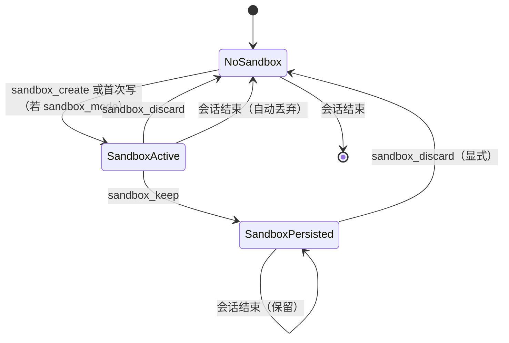

# SeekDB Fork Table 沙箱 — 实现规划

> [English](../PLAN_SEEKDB_FORK_SANDBOX.md)

**状态**：规划中  
**更新日期**：2026-02-27

---

## 1. 背景

[SeekDB FORK TABLE](https://www.oceanbase.ai/docs/fork-table-overview) 可在一致快照下创建源表的隔离副本。Fork 出的表读写独立。典型场景：A/B 测试、沙箱验证、数据版本分支。

**主要约束**：
- 仅 SeekDB 支持（MySQL/PostgreSQL/SQLite 不支持）
- 语法：`FORK TABLE source TO destination`
- 目标表必须不存在；Fork 期间与 DDL 互斥
- SeekDB V1.1.0 中为实验性功能

---

## 2. 架构概览

```mermaid
flowchart TB
    subgraph UserLayer [用户 / Agent]
        UserMsg[用户: "UPDATE users SET name='X'"]
    end

    subgraph SandboxLayer [沙箱层 - 仅 SeekDB]
        SandboxMgr[SandboxManager]
        ForkMap[table -> fork_name 映射]
    end

    subgraph ToolLayer [工具]
        QueryExec[query_execute]
        DataModify[data_modify]
        DDLExec[ddl_execute]
    end

    subgraph Rewrite [SQL 重写]
        Rewriter[TableNameRewriter]
    end

    UserMsg --> ToolLayer
    ToolLayer --> SandboxMgr
    SandboxMgr -->|"沙箱激活?"| ForkMap
    ForkMap --> Rewriter
    Rewriter -->|"UPDATE _qc_sandbox_xxx_users SET..."| SeekDB[(SeekDB)]
```

**流程**：
1. 沙箱激活时，`SandboxManager` 维护映射：`users` -> `_qc_sandbox_{id}_users`
2. 执行 SQL 前，按映射重写语句中的表名
3. 懒式 Fork：首次写某表时执行 `FORK TABLE users TO _qc_sandbox_{id}_users`
4. 读操作（SELECT）在表已加入沙箱映射时，也重定向到 fork 表

---

## 3. 设计决策

| 决策 | 选择 | 理由 |
|------|------|------|
| **触发方式** | 配置 + 显式工具 | `safety.sandbox_mode=true` 透明模式；`sandbox_create` / `sandbox_discard` / `sandbox_keep` 显式控制 |
| **作用范围** | 会话 + 可选持久 | 默认会话级，会话结束丢弃；用户可调用 `sandbox_keep` 保留 |
| **Fork 命名** | `_qc_sandbox_{sandbox_id}_{table}` | 唯一、避免冲突；`_qc` 前缀表示 QueryClaw |
| **Fork 时机** | 懒式 | 仅首次写时 fork；降低成本 |
| **读行为** | 重定向到 fork | 表在沙箱映射中时，SELECT 也走 fork（保持一致性） |

---

## 4. 组件设计

### 4.1 SandboxManager

**位置**：`queryclaw/safety/sandbox.py`

**职责**：
- 维护 `sandbox_id`（UUID）及 `table -> fork_name` 映射
- `fork_table_if_needed(table)` — 表未 fork 时执行 `FORK TABLE table TO fork_name`
- `rewrite_sql(sql)` — 按映射重写 SQL 中的表名（sqlglot AST 或正则）
- `get_fork_name(table)` — 返回 fork 名或 None
- `discard()` — `DROP TABLE` 所有 fork 表
- `keep()` — 标记持久；会话结束不自动 DROP

**会话绑定**：每个 AgentLoop（或通道模式下的会话）创建 SandboxManager。当 `sandbox_mode=True` 且 `db_type=seekdb` 时，存于 `AgentLoop._sandbox`。

### 4.2 SQL 表名重写

**方式**：用 sqlglot 解析 SQL，遍历 AST，替换映射中的 `Table` 节点。回退：简单正则。

**边界情况**：
- 别名：`FROM users u` — 重写 `users`；别名 `u` 保留
- 子查询：`SELECT * FROM (SELECT * FROM users) t` — 重写内层 `users`
- 限定名：`db.users` — 重写表部分

**新模块**：`queryclaw/safety/sql_rewriter.py` — `rewrite_table_names(sql: str, mapping: dict[str, str], dialect: str) -> str`

### 4.3 工具集成

**涉及工具**：`query_execute`、`data_modify`、`ddl_execute`、`explain_plan`

**模式**：在 `await self._db.execute(sql)` 前：

```python
if self._sandbox and self._db.db_type == "seekdb":
    sql = self._sandbox.rewrite_sql(sql)
    # data_modify/ddl：首次写前确保表已 fork
    for table in validation.tables_affected:
        await self._sandbox.fork_table_if_needed(table)
```

**注入**：SandboxManager 传入需要它的工具。`sandbox_mode=False` 或 `db_type != "seekdb"` 时 `_sandbox` 为 None，不重写。

### 4.4 新增工具

| 工具 | 用途 |
|------|------|
| `sandbox_create` | 创建新沙箱（暂不 fork；懒式 fork 首次写时执行）。返回 sandbox_id |
| `sandbox_discard` | DROP 当前沙箱所有 fork 表；清空映射 |
| `sandbox_keep` | 标记沙箱持久；会话结束不自动丢弃 |
| `sandbox_status` | 显示已 fork 的表、sandbox_id、持久标志 |

当 `sandbox_mode=true`（配置）时，首次写自动创建沙箱。工具用于显式创建/丢弃/保留。

### 4.5 配置与 SafetyConfig

**Schema**（[config/schema.py](../queryclaw/queryclaw/config/schema.py)）：

```python
# 在 SafetyConfig 中
sandbox_mode: bool = False  # True + SeekDB 时，写操作走 fork
sandbox_auto_create: bool = True  # sandbox_mode=True 时，首次写自动创建沙箱
```

---

## 5. Context 与 Schema 注入

**行为**：`ContextBuilder` 注入 schema。沙箱激活时**不**改变 schema 视图 — Agent 仍看到 `users`、`orders` 等。重写在执行时完成，保持 Agent 心智模型简单。

**可选**：沙箱激活时在 context 加一行：`"（沙箱已激活：读写使用隔离表副本。）"`

---

## 6. 会话生命周期



**通道模式**：Session ID 来自消息上下文中的 `session_id`（如飞书 `open_id` + thread）。SandboxManager 按 session_id 管理。

---

## 7. 限制与考虑

| 限制 | 应对 |
|------|------|
| 仅 SeekDB | 检查 `db_type == "seekdb"`；其他 DB 无操作 |
| FORK TABLE 实验性 | 文档说明；可选功能 |
| 外键 / 多表 | 首次触及各表时 fork；FK 引用仍有效（fork 中 PK 相同） |
| DDL 作用于 fork | 沙箱中 ALTER/DROP "users" → 操作 fork |
| Promote（回写） | v1 不做；文档说明手动流程 |

---

## 8. 文件变更汇总

| 文件 | 变更 |
|------|------|
| `queryclaw/safety/sandbox.py` | **新建** — SandboxManager |
| `queryclaw/safety/sql_rewriter.py` | **新建** — 表名重写 |
| `queryclaw/tools/sandbox.py` | **新建** — sandbox_create、sandbox_discard、sandbox_keep、sandbox_status |
| `queryclaw/config/schema.py` | 在 SafetyConfig 中增加 sandbox_mode、sandbox_auto_create |
| `queryclaw/tools/query.py` | 注入 SandboxManager；执行前重写 SQL |
| `queryclaw/tools/modify.py` | 注入 SandboxManager；写前 fork，重写 SQL |
| `queryclaw/tools/ddl.py` | 注入 SandboxManager；沙箱表 DDL 重写 SQL |
| `queryclaw/tools/explain.py` | 注入 SandboxManager；重写 SQL |
| `queryclaw/agent/loop.py` | seekdb + sandbox_mode 时创建 SandboxManager；传入工具；会话清理 |
| `queryclaw/agent/context.py` | 可选沙箱提示 |
| `queryclaw/skills/seekdb_fork_sandbox/SKILL.md` | **新建** — 沙箱工作流 Skill |

---

## 9. 实现顺序

1. **sql_rewriter.py** — 纯函数，可单元测试
2. **sandbox.py (SandboxManager)** — 核心逻辑，依赖 db 适配器
3. **Config** — SafetyConfig 字段
4. **工具接入** — 将 SandboxManager 传入 query、modify、ddl、explain
5. **sandbox 工具** — sandbox_create、sandbox_discard、sandbox_keep、sandbox_status
6. **AgentLoop** — 创建 SandboxManager、会话绑定、清理
7. **Skill** — seekdb_fork_sandbox SKILL.md
8. **测试** — rewriter 单元测试；沙箱流程集成测试（无 SeekDB 时跳过）

---

## 10. Skill：seekdb_fork_sandbox

当用户询问沙箱、安全实验或「在不影响生产数据的前提下尝试修改」时：

1. 检查 `db_type == seekdb`；否则说明 FORK TABLE 仅支持 SeekDB
2. 若配置中已开启 sandbox_mode，说明已启用
3. 否则引导：调用 `sandbox_create`，再执行实验（data_modify、ddl_execute）
4. 结束时：`sandbox_discard` 清理，或 `sandbox_keep` 保留
5. 说明：FORK TABLE 在 SeekDB V1.1.0 中为实验性功能
